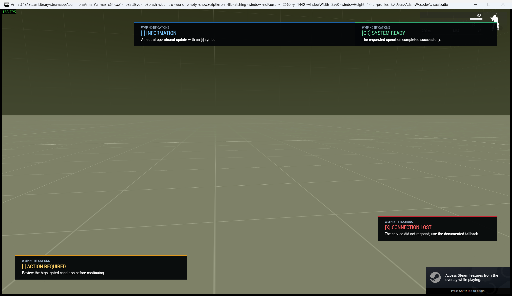
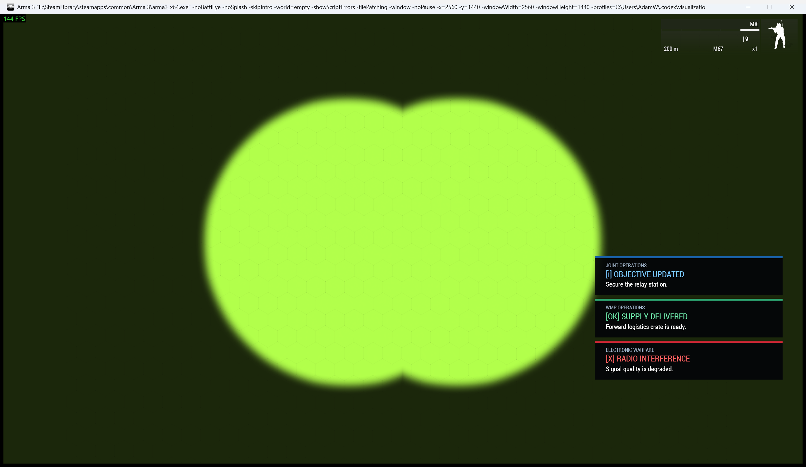
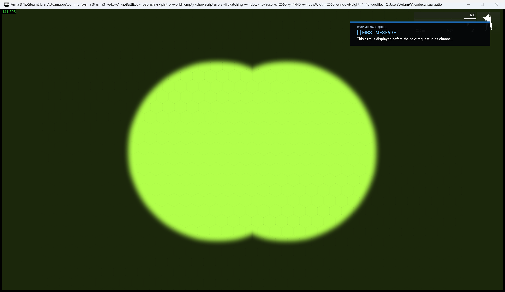
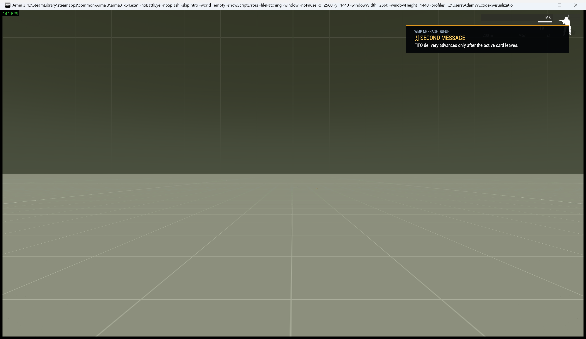

# Custom WMP UI Notifications

> **Use this page when:** you need safe-zone-aware player notifications with semantic states, placement, stacking, or FIFO delivery.

WMP includes a reusable notification-card system for mission updates, warnings and persistent equipment status. It is the same safe-zone-aware presentation used by Economy feedback, ENDEX/AAR, patient treatment feedback, persistence, field resupply, vehicle recovery, squad rallies, Dynamic AA, airborne gunships and manual respawn-loadout saving.

The system is local to each player's interface. Mission code decides who receives a notification by choosing the remote-execution target.

## What players see

Every state uses colour, a written label and a symbol. Information remains understandable when colour cannot be distinguished.



| State | Symbol | Intended use |
|---|---|---|
| `INFO` | `[i]` | Neutral updates and instructions |
| `SUCCESS` | `[OK]` | Confirmed completion or restored service |
| `WARNING` | `[!]` | A condition requiring attention |
| `ERROR` | `[X]` | Failure, loss or an unavailable service |

Cards measure their text, retain internal padding and stay inside Arma's current safe zone. Available placements are `TOP`, `TOP_RIGHT`, `CENTER`, `BOTTOM_LEFT` and `BOTTOM_RIGHT`.

## Basic mission-maker use

```sqf
[
    "SUPPLY DELIVERED",
    "The forward crate is ready for collection.",
    "SUCCESS",
    8,
    "TOP",
    "LOGISTICS",
    "WMP OPERATIONS // LOGISTICS"
] call Waldo_fnc_ShowUiNotification;
```

The arguments are:

```sqf
[title, message, state, duration, placement, channel, source, policy, priority, allowLocalOverride]
```

| Argument | Type | Meaning |
|---|---|---|
| `title` | String | Main notification heading |
| `message` | String or structured text | Explanation shown below the heading |
| `state` | String | `INFO`, `SUCCESS`, `WARNING` or `ERROR` |
| `duration` | Number | Lifetime in seconds; `0` remains until replaced or dismissed |
| `placement` | String | Requested screen region |
| `channel` | String | Ownership and sequencing key, such as `LOGISTICS` or `ELECTRONIC_WARFARE` |
| `source` | String | Small system or mission label above the title |
| `policy` | String | `AUTO`, `FIFO` or `REPLACE` |
| `priority` | Number | Mission metadata retained with the active card |
| `allowLocalOverride` | Boolean | Whether an authorized player placement may be used |

The function returns a unique token for a displayed card, `"QUEUED"` when the request enters a bounded queue, or an empty string when no interface is available. If the gameplay display is still opening, WMP keeps one bounded, coalesced waiting set and waits for it for up to 20 seconds rather than starting one waiter per request.

## Channels, stacking and replacement

A channel identifies one stream of related notifications. Different channels can share a screen region without drawing over one another. WMP measures and stacks up to three active cards in that region. When that region is full, independent channels can use the configured overflow regions at the same time before any request waits in the queue.



Use a stable channel name for every update from one system:

```sqf
[
    "RADIO INTERFERENCE",
    "Signal quality is degraded.",
    "ERROR",
    0,
    "BOTTOM_RIGHT",
    "ELECTRONIC_WARFARE",
    "ELECTRONIC WARFARE",
    "REPLACE"
] call Waldo_fnc_ShowUiNotification;
```

Calling `REPLACE` again on `ELECTRONIC_WARFARE` removes only that channel's old card. Other systems remain visible. This is the correct policy for live status, countdowns and equipment readings.

`AUTO` selects `REPLACE` for persistent cards (`duration = 0`) and `FIFO` for timed cards. Specify a policy when the intended behavior should be obvious in mission code.

## Bounded message delivery

`FIFO` preserves the active card and permits one pending update per channel. Further requests on that channel coalesce into the newest pending state of equal or greater importance. This is intentional back-pressure: a frequently updating system cannot create a long replay after the event has passed.

| First request active | Queue advances to second request |
|---|---|
|  |  |

The queue is capped at 12 channels by default. Pending cards expire after 15 seconds, and warning/error entries take precedence when an overflow decision is required. These player-local defaults can be changed in `initPlayerLocal.sqf`:

```sqf
Waldo_UiNotification_MaximumQueued = 12;
Waldo_UiNotification_QueueLifetime = 15;
Waldo_UiNotification_MaximumPerPlacement = 3;
Waldo_UiNotification_AllowPlacementOverflow = true;
Waldo_UiNotification_OverflowPlacements = ["TOP_RIGHT", "BOTTOM_RIGHT", "TOP", "BOTTOM_LEFT"];
```

`CENTER` is deliberately not in the default overflow order because unsolicited cards there can obstruct aiming and interaction. A mission can add it when appropriate.

To dismiss a channel and discard its queued requests:

```sqf
["LOGISTICS"] call Waldo_fnc_DismissUiNotification;
```

The return value is `true` when an active or queued request was removed. Dismissal is local and does not affect the same channel on another client.

## Mission-authored placement

The placement in a notification call is its fallback. A mission can reserve a position for a channel during initialization:

```sqf
// [channel, placement, allowLocalPlayerOverride, publish]
["ELECTRONIC_WARFARE", "BOTTOM_RIGHT", false, true]
    call Waldo_fnc_SetUiPanelPlacement;
```

Call this on the server with `publish = true` when every client, including JIP players, should receive the setting. A local mission may configure it from `initPlayerLocal.sqf` instead.

If the mission explicitly permits local choice, a player can store a preferred position:

```sqf
["ELECTRONIC_WARFARE", "BOTTOM_LEFT", true]
    call Waldo_fnc_SetLocalUiPanelPlacement;
```

The local helper refuses unauthorized channels. Accepted choices are stored in `profileNamespace`. The notification itself must also set `allowLocalOverride = true`; otherwise the mission-authored position remains authoritative.

Resolution order is:

1. Placement requested by the notification.
2. Published mission default for that channel.
3. Permitted local player override.

Mission placement therefore remains the default and the mission maker controls whether a player can change it.

## Locality and multiplayer targeting

`Waldo_fnc_ShowUiNotification` creates controls only on a client with an interface. A dedicated server safely returns without drawing anything.

Show a card to every current client:

```sqf
[
    "OBJECTIVE UPDATED",
    "Secure the relay station.",
    "INFO",
    10,
    "TOP",
    "OBJECTIVE",
    "JOINT OPERATIONS"
] remoteExecCall ["Waldo_fnc_ShowUiNotification", -2];
```

Show it to one player by targeting that unit's owner:

```sqf
private _targetOwner = owner _player;
[
    "ACCESS GRANTED",
    "The bunker door controls are now available.",
    "SUCCESS",
    8,
    "TOP_RIGHT",
    "ACCESS",
    "SECURITY SYSTEM"
] remoteExecCall ["Waldo_fnc_ShowUiNotification", _targetOwner];
```

The notification system does not broadcast gameplay state. Publish authoritative state separately, then notify the clients who need to see it.

## Cleanup and recovery

Remove all local WMP-owned panels and transient displays:

```sqf
[] call Waldo_fnc_ClearUiPanels;
```

Cleanup is repeat-safe and does not delete Arma, ACE, ACRE2, TFAR or mission-authored controls. Closing an active field-equipment procedure may abandon that attempt, so full cleanup is an emergency recovery action rather than normal navigation.

Players receive **WMP Interface > Clear Stuck WMP UI** under ACE self-interaction. When ACE interaction is unavailable, WMP installs a low-priority vanilla action instead. The action is restored after respawn and requires no public scheduler.

## Tested presentation

The screenshots on this page were captured from the real Arma 3 client at 2560x1440 using CBA, ACE, Zeus Enhanced and ACRE2 with BattlEye disabled. The reusable QA cases verify:

- all four semantic states;
- independent channel stacking;
- the first and second stage of FIFO delivery;
- local cleanup between cases;
- readable text, internal padding and safe-zone placement.

The capture cases live in `releaseVerificationAndDeployment/documentationCaptureQA` and are excluded from normal release packages.

<!-- WMP-WIKI-NAV -->
---
[Wiki home](Home) · [Quickstart](Quickstart-Guide) · [Feature index](Feature-Tutorials)
