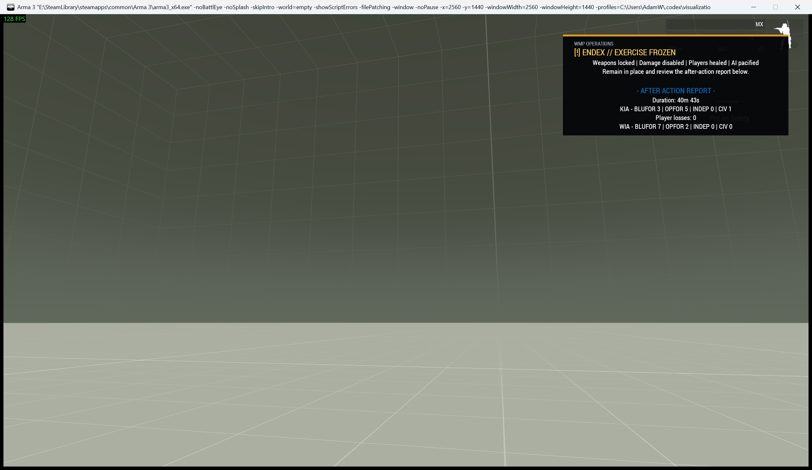

# ENDEX and After-Action Report

> **Use this page when:** you need to end combat, show the AAR, reset protection, or configure the mission end screen.

_Associated files: `MissionScripts\MissionFlowAndUi\ENDEX.sqf`, `ENDEXReset.sqf`, `aarTrack.sqf`, `Waldo_fnc_ENDEX`, `Waldo_fnc_ENDEXReset`, `Waldo_fnc_AARTrack`_


ENDEX places the mission into a controlled debrief state. The After-Action Report is part of the same transition, so an operator does not need to coordinate separate end-of-mission systems.



## What players experience

When ENDEX activates:

- player weapons and vehicle weapons are prevented from firing;
- players are healed and protected from damage;
- hostile AI is made passive;
- a branded WMP Operations panel explains the debrief state;
- the same panel rotates through numbered AAR pages so a long report remains readable without
  creating extra notification cards or briefing records;
- JIP clients receive the current ENDEX state.

The notification uses its own `ENDEX` channel. Repeated activation replaces the existing panel instead of stacking another UI element. Reset dismisses that exact channel and removes only protections owned by ENDEX.

## Starting and resetting ENDEX

The API is server-authoritative. Calls made on a client are forwarded to the server.

```sqf
[] call Waldo_fnc_ENDEX;
```

The server publishes `Waldo_ENDEX_Active = true`, then applies the state once on every client.

For rehearsals and test missions, reset with:

```sqf
[] call Waldo_fnc_ENDEXReset;
```

ENDEX and SafeStart track their handlers, damage state, and ACE weapon-safety ownership separately. Resetting ENDEX does not lift active SafeStart protection. Ending SafeStart does not lift active ENDEX protection.

## After-Action Report

Tracking starts through `[] call Waldo_fnc_AARTrack`. It uses mission event handlers rather than a per-frame loop. If tracking did not run, ENDEX still works and simply omits unavailable report sections.

The report first packs all useful sections into one ENDEX card. It creates additional pages only
when the content genuinely exceeds that space, then balances the rows between pages so it does not
leave a nearly empty final page. Page numbers appear only when more than one page is required. The
report can include:

| Section | Source |
|---|---|
| Duration | Time since mission start |
| KIA by side | Dead infantry |
| Player losses | Human-player deaths |
| Vehicles lost by side | Destroyed vehicles |
| Friendly fire | Kills where shooter and victim share a side |
| Objectives | Tasks managed through WMP objective helpers |
| Top fraggers | Enemy kills credited to human players |

Empty sections are omitted. Temporary ACE unconscious/WIA events are deliberately not displayed:
they are not a final mission outcome and overlap the more useful KIA and named confirmed-death
information. Objective summaries populate when objectives use [Tasks and Objectives](Tasks-And-Objectives).

Set the panel duration before activation if the 45-second default is unsuitable:

```sqf
missionNamespace setVariable ["Waldo_ENDEX_ReportDuration", 60, true];
[] call Waldo_fnc_ENDEX;
```

## Zeus usage

Use **Mission Flow: End Mission + Show AAR** under **WMP Mission Flow**. It calls the same public, server-authoritative function as script setup. The reset function is intended for rehearsals and controlled testing rather than normal mission flow.

## Diagnostics

```sqf
private _report = [] call Waldo_fnc_ENDEXGetDiagnostics;
```

The helper reports whether ENDEX code is loaded, whether it is active, whether AAR tracking exists, and whether owned client protection/UI state is present. It is also included in `[] call Waldo_fnc_RunDiagnostics` under the mission-flow feature area.

## Custom mission end screen

ENDEX creates a debrief state; it does not itself close the scenario. After debrief, use a configured ending from `description.ext`:

```sqf
["end1"] remoteExec ["BIS_fnc_endMission", 0, true];
```

Configure the ending title, subtitle, description, and image in `description.ext`. This final Arma screen is separate from the live ENDEX/AAR panel.

## See also

- [SafeStart](Safestart)
- [Custom WMP UI Notifications](Custom-UI-Notifications)
- [Mission Diagnostics](Mission-Diagnostics)
- [Waldos Mission Pack Zeus Modules](Waldos-Mission-Pack-Zeus-Modules)

<!-- WMP-WIKI-NAV -->
---
[Wiki home](Home) · [Quickstart](Quickstart-Guide) · [Feature index](Feature-Tutorials)
