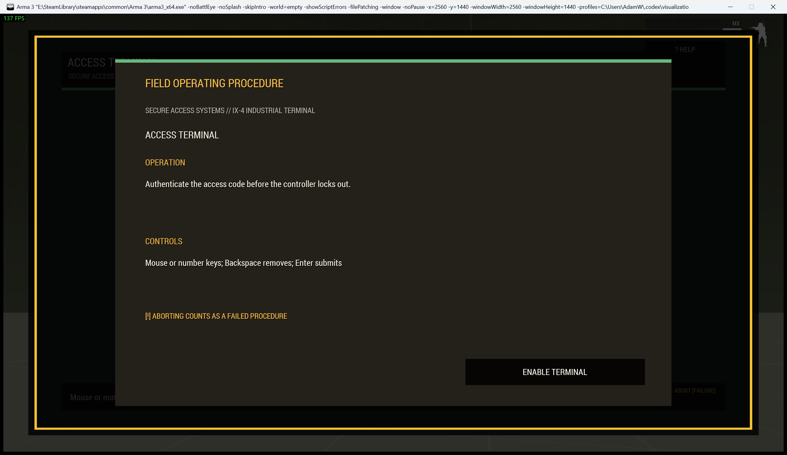
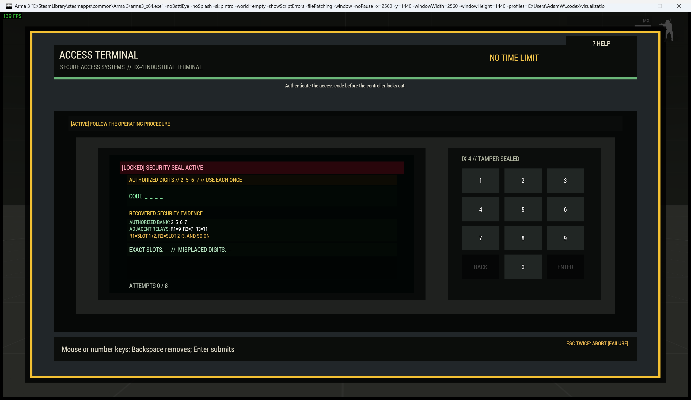

# Industrial Access Terminal

> **Use this page when:** you are configuring or operating the evidence-driven keypad procedure.

_Associated Files: `MissionScripts\InteractionsMinigames\`, `Waldo_fnc_MiniGameInteractionSetup`_

The `keypad` procedure represents an access terminal or safe controller whose authorization code must be recovered from on-screen records.

| Operating card | Active terminal |
|---|---|
|  |  |

**Simplest setup** — every other option below has a working default:

```sqf
[this, "keypad"] call Waldo_fnc_MiniGameInteractionSetup;
```

## Operator procedure

Correlate the authorized digit bank, recovered prefix, and reverse-order backup tail. Read the tail right-to-left and append it to the prefix. Enter the result with the physical keypad or number keys; use Backspace to correct and Enter to submit. Every numeral remains available, so the evidence guides the solution without giving it away through disabled keys. The attempt log marks exact and misplaced digits after a submitted guess.

## Difficulty and configuration

Difficulty increases code length and can introduce a time limit while retaining enough evidence to derive the answer.

```sqf
[this, "keypad", createHashMapFromArray [
    ["difficulty", "hard"],
    ["preset", "safeController"],
    ["actionTitle", "Bypass Safe Controller"]
]] call Waldo_fnc_MiniGameInteractionSetup;
```

Valid configuration: `[digits(3-6,4), maxGuesses(6), timeLimit(0), title("ACCESS TERMINAL")]`.

[Shared state and mission integration](Waldos-Mini-Games-Interaction-Challenges#authoritative-lifecycle-and-mission-state)

<!-- WMP-WIKI-NAV -->
---
[Wiki home](Home) · [Quickstart](Quickstart-Guide) · [Feature index](Feature-Tutorials)
