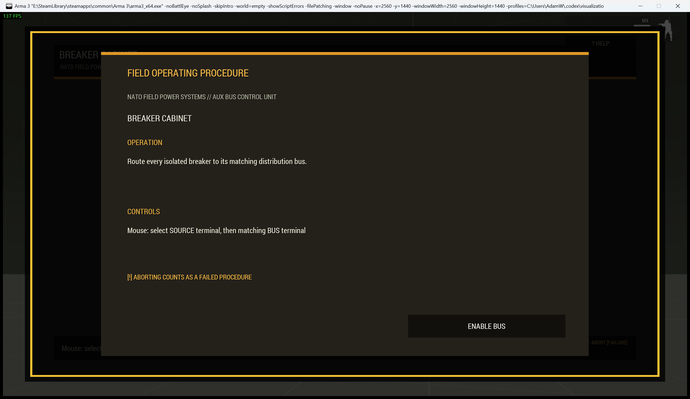

# Breaker and Relay Cabinet

> **Use this page when:** you are configuring or operating the terminal-routing circuit procedure.

The `circuit` procedure represents a breaker cabinet, fuse panel, or communications relay whose isolated terminals must be routed to matching buses.

| Operating card | Active cabinet |
|---|---|
|  |  |

## Operator procedure

Select a labelled source terminal, then select its matching distribution bus. Symbols and engraved identities duplicate the cable colours. Correct routes remain visibly connected; an incorrect route records a mistake. Complete every pair before the mistake or time limit.

## Difficulty and configuration

Difficulty increases pair count and reduces mistake allowance. Hard and expert profiles also impose time limits.

```sqf
[this, "circuit", createHashMapFromArray [
    ["difficulty", "hard"],
    ["preset", "generatorBreaker"],
    ["actionTitle", "Inspect Generator Cabinet"],
    ["title", "GENERATOR BUS B"]
]] call Waldo_fnc_MiniGameInteractionSetup;
```

Valid configuration: `[pairs(3-6,4), maxMistakes(3), timeLimit(0), title("BREAKER CABINET")]`.

[Shared state and mission integration](Waldos-Mini-Games-Interaction-Challenges#authoritative-lifecycle-and-mission-state)

<!-- WMP-WIKI-NAV -->
---
[Wiki home](Home) · [Quickstart](Quickstart-Guide) · [Feature index](Feature-Tutorials)
