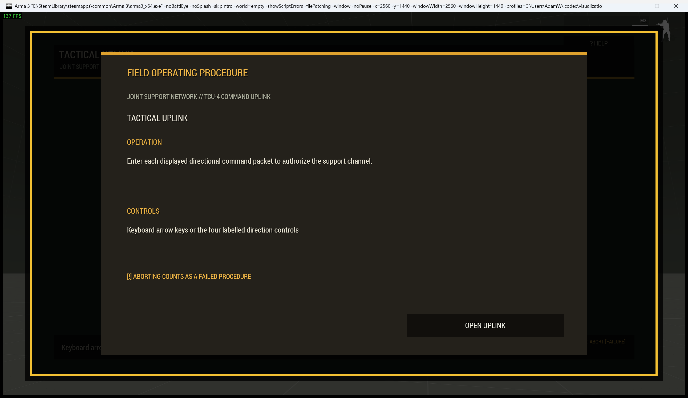
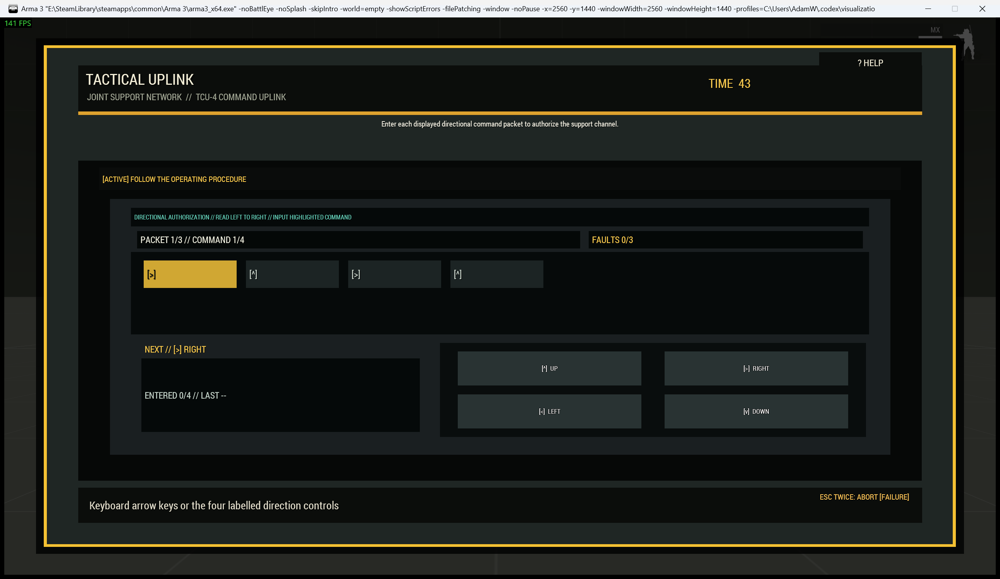

# Tactical Command Uplink

> **Use this page when:** you are configuring or operating the directional command-entry procedure.

_Associated Files: `MissionScripts\InteractionsMinigames\`, `Waldo_fnc_MiniGameInteractionSetup`_

The `commandinput` procedure is a directional command-entry console inspired by field support and terminal authorization interfaces.

| Operating card | Active uplink |
|---|---|
|  |  |

**Simplest setup** — every other option below has a working default:

```sqf
[this, "commandinput"] call Waldo_fnc_MiniGameInteractionSetup;
```

## Operator procedure

Read the packet from left to right and enter each highlighted direction with the keyboard arrows or the four large labelled controls. Correct entries receive `[OK]`. A wrong direction records a fault and restarts only the current packet. Complete every packet before exhausting the fault or time limit.

Every command combines an ASCII arrow, direction word, active-cell outline, and result text.

## Difficulty and configuration

Difficulty increases packet length and round count while reducing the fault allowance.

```sqf
[this, "commandinput", createHashMapFromArray [
    ["difficulty", "standard"],
    ["preset", "supportTerminal"],
    ["actionTitle", "Authorize Support Channel"]
]] call Waldo_fnc_MiniGameInteractionSetup;
```

Valid configuration: `[baseLength(3-8,4), rounds(1-6,3), maxMistakes(1-6,3), timeLimit(45), title("TACTICAL UPLINK")]`.

[Shared state and mission integration](Waldos-Mini-Games-Interaction-Challenges#authoritative-lifecycle-and-mission-state)

<!-- WMP-WIKI-NAV -->
---
[Wiki home](Home) · [Quickstart](Quickstart-Guide) · [Feature index](Feature-Tutorials)
