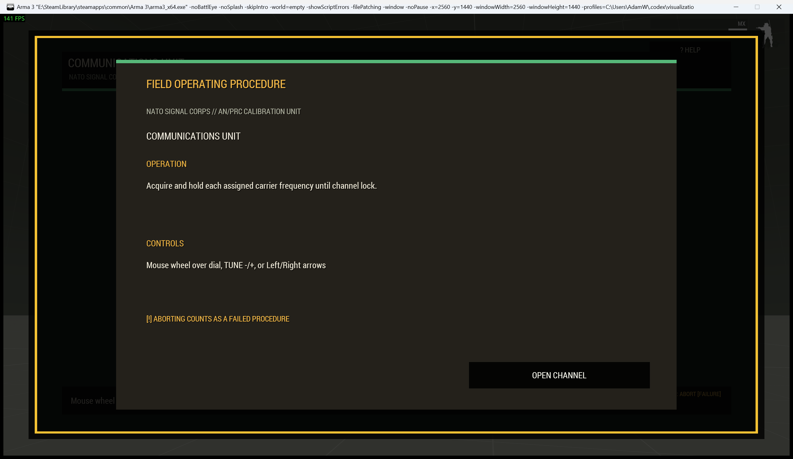
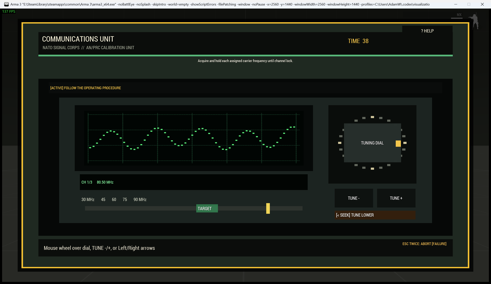

# Tactical Communications Unit

> **Use this page when:** you are configuring or operating the radio-carrier tuning procedure.

_Associated Files: `MissionScripts\InteractionsMinigames\`, `Waldo_fnc_MiniGameInteractionSetup`_

The `radiotune` procedure represents a NATO-style radio, antenna controller, or distress-beacon receiver.

| Operating card | Active radio |
|---|---|
|  |  |

**Simplest setup** — every other option below has a working default:

```sqf
[this, "radiotune"] call Waldo_fnc_MiniGameInteractionSetup;
```

## Operator procedure

Turn the tuning dial by dragging, using its mouse wheel, pressing the tuning buttons, or using Left/Right. Align the needle with the labelled carrier band and hold it steady until locked. Each acquired carrier advances the channel selector. Frequency text, waveform, target band, needle, signal meter, and lock caption all describe the same state.

## Difficulty and configuration

Difficulty adds channels, narrows the tolerance, and increases the required stable hold.

```sqf
[this, "radiotune", createHashMapFromArray [
    ["difficulty", "hard"],
    ["preset", "antennaController"],
    ["actionTitle", "Acquire Relay Carrier"]
]] call Waldo_fnc_MiniGameInteractionSetup;
```

Valid configuration: `[channels(1-5,3), tolerance(0.02-0.15,0.05), holdTime(1), timeLimit(30), title("COMMUNICATIONS UNIT")]`.

[Shared state and mission integration](Waldos-Mini-Games-Interaction-Challenges#authoritative-lifecycle-and-mission-state)

<!-- WMP-WIKI-NAV -->
---
[Wiki home](Home) · [Quickstart](Quickstart-Guide) · [Feature index](Feature-Tutorials)
