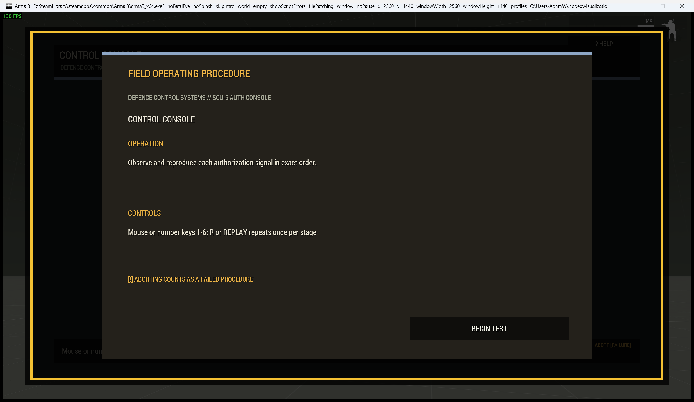
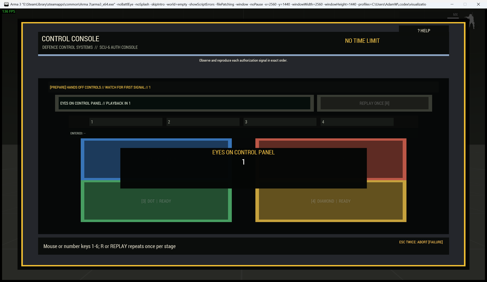

# Secure Control Sequence

> **Use this page when:** you are configuring or operating the observe-and-repeat control sequence.

The `sequence` procedure represents a guarded control console that plays progressively longer authorization signals.

| Operating card | Active console |
|---|---|
|  |  |

## Operator procedure

A three-count **EYES ON CONTROL PANEL** warning precedes playback. During **OBSERVE**, input controls are disabled and a separate cue layer shows each numbered, shaped signal with consistent illumination. During **YOUR INPUT**, reproduce the sequence by mouse or number keys. The console records entered signals and permits one replay per stage with `R` or the replay control.

Reduced-motion mode removes abrupt animation without shortening cue duration. Number, shape, name, phase labels, and the input transcript make the procedure usable without colour.

## Difficulty and configuration

Difficulty adds pads and stages. Standard through expert retain a readable 0.85-second playback; expert difficulty comes from length, not imperceptible flashes.

```sqf
[this, "sequence", createHashMapFromArray [
    ["difficulty", "hard"],
    ["actionTitle", "Run Authorization Sequence"]
]] call Waldo_fnc_MiniGameInteractionSetup;
```

Valid configuration: `[padCount(3-6,4), rounds(1-8,4), playbackSpeed(0.25-1.5,0.85), timeLimit(0), title("CONTROL CONSOLE")]`.

[Shared state and mission integration](Waldos-Mini-Games-Interaction-Challenges#authoritative-lifecycle-and-mission-state)

<!-- WMP-WIKI-NAV -->
---
[Wiki home](Home) · [Quickstart](Quickstart-Guide) · [Feature index](Feature-Tutorials)
