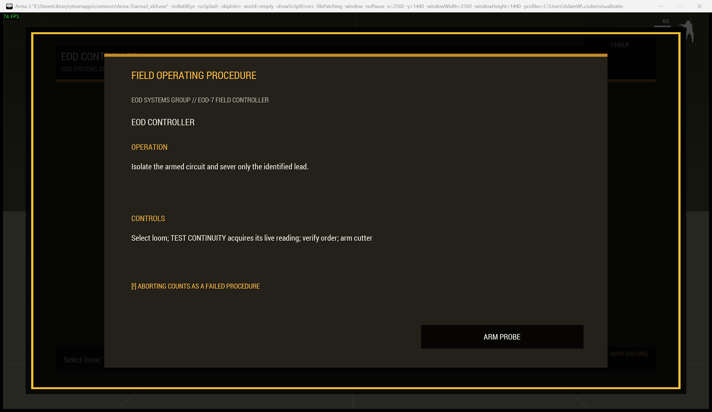
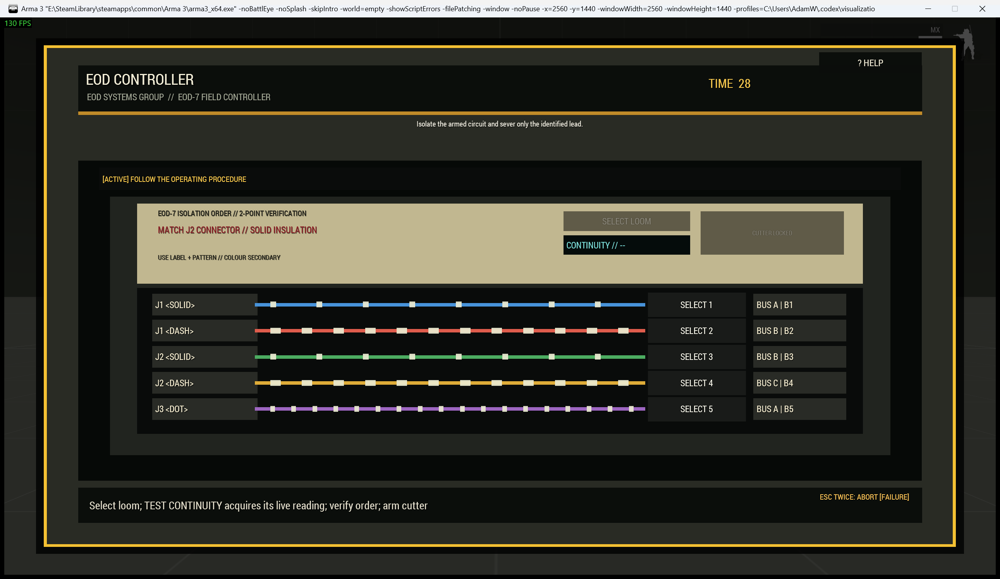

# EOD Controller

> **Use this page when:** you are configuring or operating the loom-identification and isolation procedure.

_Associated Files: `MissionScripts\InteractionsMinigames\`, `Waldo_fnc_MiniGameInteractionSetup`_

The `wirecut` procedure represents a rugged field controller used to isolate and sever one live lead. It is suitable for bombs, demolition charges, vehicle sabotage, and booby-trapped equipment.

| Operating card | Active controller |
|---|---|
|  |  |

**Simplest setup** — every other option below has a working default:

```sqf
[this, "wirecut"] call Waldo_fnc_MiniGameInteractionSetup;
```

## Operator procedure

Read the isolation order, then compare the bay, connector, insulation pattern, routed bus, and continuity requirement against the labelled looms. Select a candidate and run the continuity probe. The cutter unlocks only after a live reading has been acquired. Cutting the correct loom succeeds; cutting the wrong one, timing out, or confirming abort fails.

Colour is supplementary: every loom also has a connector, pattern, bay, bus, and acquired continuity label.

## Difficulty and configuration

Difficulty increases the number of independent readings that must agree, from one at easy to four at expert. It also changes loom count and time; it does not add arbitrary confirmation inputs.

```sqf
// [wireCount, timeLimit, title, verificationLevel]
[this, "wirecut", createHashMapFromArray [
    ["difficulty", "hard"],
    ["actionTitle", "Defuse Training Charge"],
    ["preset", "vehicleCharge"]
]] call Waldo_fnc_MiniGameInteractionSetup;
```

Valid configuration: `[wireCount(3-6,5), timeLimit(20), title("EOD CONTROLLER"), verificationLevel(1-4,derived)]`. Existing three-value configurations remain valid.

## Live explosive setup

`Waldo_fnc_BombDefuseSetup` applies an explosive consequence to the shared interaction-procedure system. It defaults to this `wirecut` procedure, but a mission maker may select any built-in procedure with `challengeId`.

```sqf
[this, createHashMapFromArray [
    ["difficulty", "hard"],
    ["actionTitle", "Defuse Vehicle Charge"],
    ["equipmentTitle", "EOD CONTROL UNIT"],
    ["preset", "vehicleCharge"],
    ["detonateOnFailure", true],
    ["oneShot", true]
]] call Waldo_fnc_BombDefuseSetup;
```

For every supported procedure, consequence option, compatibility rule, and setup example, see [Bomb Defusal](Bomb-Defusal).

[Shared state, callbacks, ACE conditions and reset](Waldos-Mini-Games-Interaction-Challenges#authoritative-lifecycle-and-mission-state)

<!-- WMP-WIKI-NAV -->
---
[Wiki home](Home) · [Quickstart](Quickstart-Guide) · [Feature index](Feature-Tutorials)
