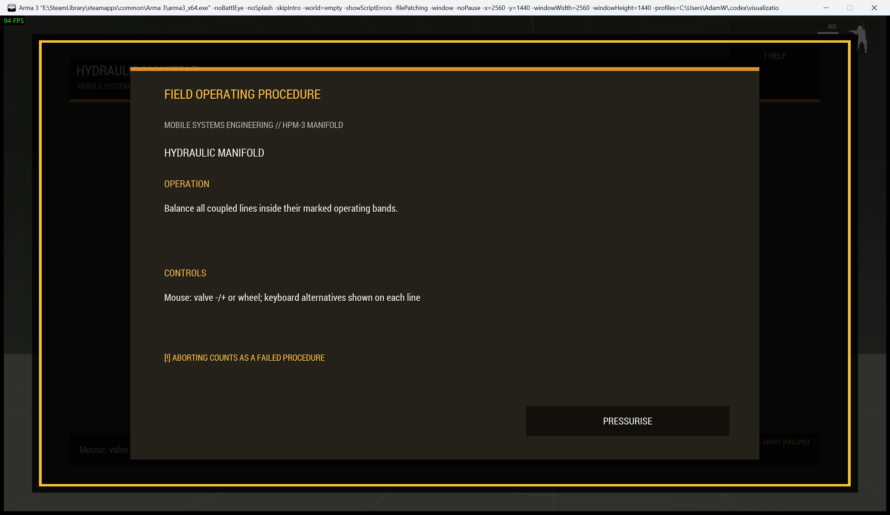
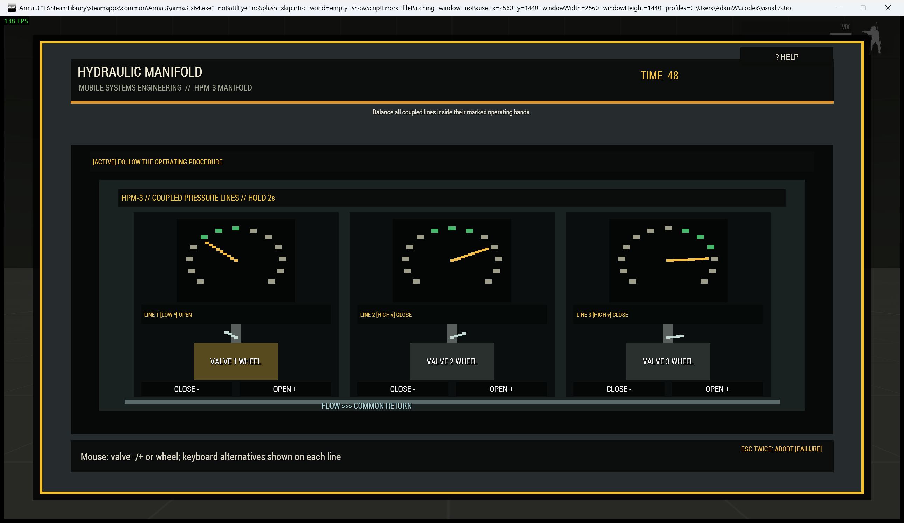

# Hydraulic Control Manifold

The `pressure` procedure represents a hydraulic, pneumatic, fuel-pressure, or coolant-control manifold with coupled lines.

| Operating card | Active manifold |
|---|---|
|  |  |

## Operator procedure

Select a valve with the mouse or keys 1-4. Operate it with its wheel, on-screen controls, or Left/Right. Each valve changes its own gauge and neighbouring lines, so adjustments must be balanced. Bring every needle inside its labelled safe band and keep the system stable for the settle period.

Each gauge explicitly says LOW, SAFE, or HIGH and uses needle position as well as colour.

## Difficulty and configuration

Difficulty increases valve count and coupling pressure while narrowing safe bands.

```sqf
[this, "pressure", createHashMapFromArray [
    ["difficulty", "standard"],
    ["preset", "coolantControl"],
    ["actionTitle", "Stabilize Coolant Manifold"]
]] call Waldo_fnc_MiniGameInteractionSetup;
```

Valid configuration: `[valveCount(2-4,3), difficulty(1-3,1), settleTime(2), timeLimit(45), title("HYDRAULIC MANIFOLD")]`.

[Shared state and mission integration](Waldos-Mini-Games-Interaction-Challenges#authoritative-lifecycle-and-mission-state)
