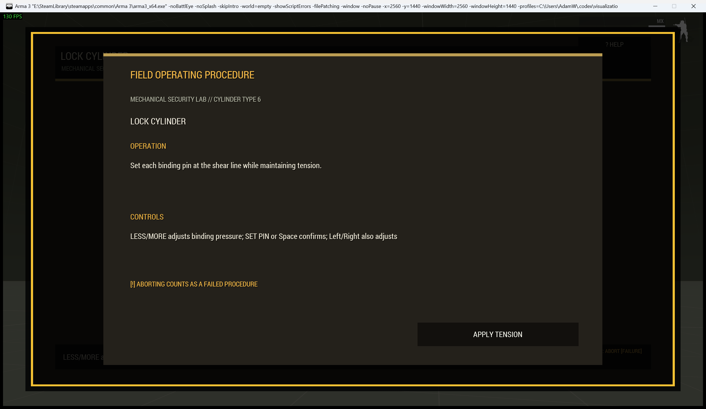
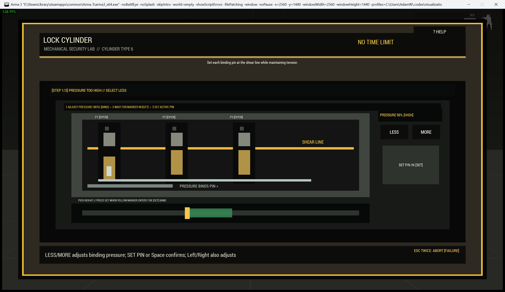

# Cutaway Lock Cylinder

The `lockpick` procedure exposes the pin stacks, shear line, pick, tension state, and cylinder progress of a mechanical lock.

| Operating card | Active cylinder |
|---|---|
|  |  |

## Operator procedure

Adjust tension with the on-screen controls or Left/Right until the tool reports `[BIND]`. The display also identifies tension as low or high. Press Set Pin or Space while the moving pick is inside the labelled set window. Each set pin changes the required tension; set every pin to turn the cylinder.

Pin position, binding text, shear-line geometry, tool movement, and progress all provide non-colour feedback.

## Difficulty and configuration

Difficulty increases pin count, narrows the set window, shortens the time limit, and changes the sweep period from 3.2 seconds at easy to 1.9 at expert.

```sqf
[this, "lockpick", createHashMapFromArray [
    ["difficulty", "standard"],
    ["actionTitle", "Pick Service Door Lock"]
]] call Waldo_fnc_MiniGameInteractionSetup;
```

Valid configuration: `[pins(1-6,3), sweepPeriod(2.8), sweetSpotWidth(0.16), timeLimit(0), title("LOCK CYLINDER")]`.

[Shared state and mission integration](Waldos-Mini-Games-Interaction-Challenges#authoritative-lifecycle-and-mission-state)
