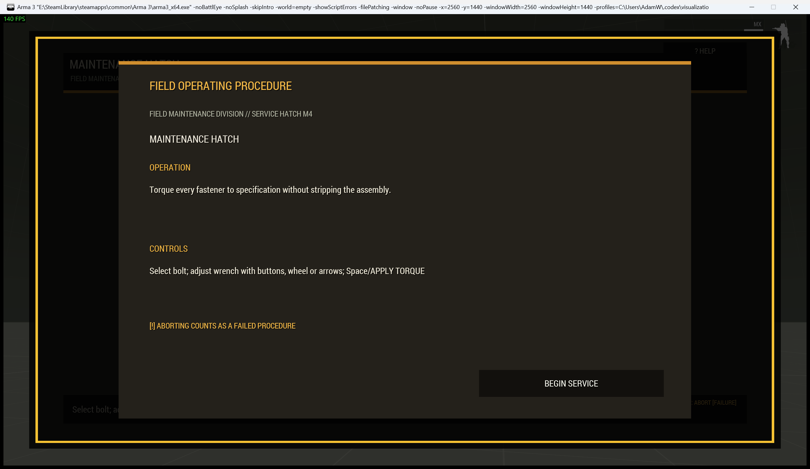
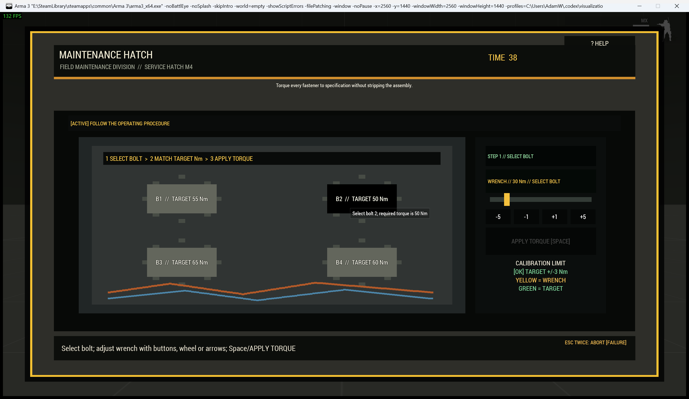

# Maintenance Hatch

> **Use this page when:** you are configuring or operating the calibrated torque repair procedure.

_Associated Files: `MissionScripts\InteractionsMinigames\`, `Waldo_fnc_MiniGameInteractionSetup`_

The `repair` procedure represents a service hatch containing fasteners that must be tightened to their engraved torque specifications.

| Operating card | Active hatch |
|---|---|
|  |  |

**Simplest setup** — every other option below has a working default:

```sqf
[this, "repair"] call Waldo_fnc_MiniGameInteractionSetup;
```

## Operator procedure

Select a bolt and read its target in newton metres. Calibrate the wrench with `-5`, `-1`, `+1`, and `+5`, the mouse wheel, or arrow keys. The numeric readout and shared scale identify LOW, HIGH, or `[OK] MATCH`. Apply torque only when matched. Applying outside tolerance records a mistake; seat every bolt to complete the repair.

## Difficulty and configuration

Difficulty adds bolts, increases calibration precision, and reduces mistake allowance. The second positional value retains the original config shape but now selects a clear calibration-precision mechanic.

```sqf
[this, "repair", createHashMapFromArray [
    ["difficulty", "standard"],
    ["preset", "engineService"],
    ["actionTitle", "Service Engine Hatch"]
]] call Waldo_fnc_MiniGameInteractionSetup;
```

Valid configuration: `[boltCount(3-6,4), precision(1-4,2), maxMistakes(3), timeLimit(30), title("MAINTENANCE HATCH")]`.

[Shared state and mission integration](Waldos-Mini-Games-Interaction-Challenges#authoritative-lifecycle-and-mission-state)

<!-- WMP-WIKI-NAV -->
---
[Wiki home](Home) · [Quickstart](Quickstart-Guide) · [Feature index](Feature-Tutorials)
