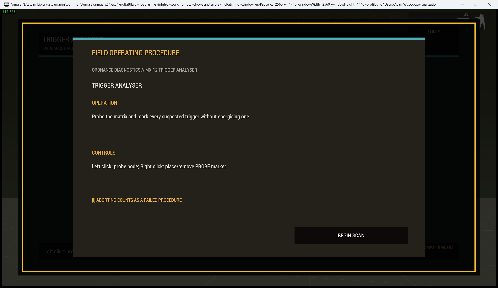
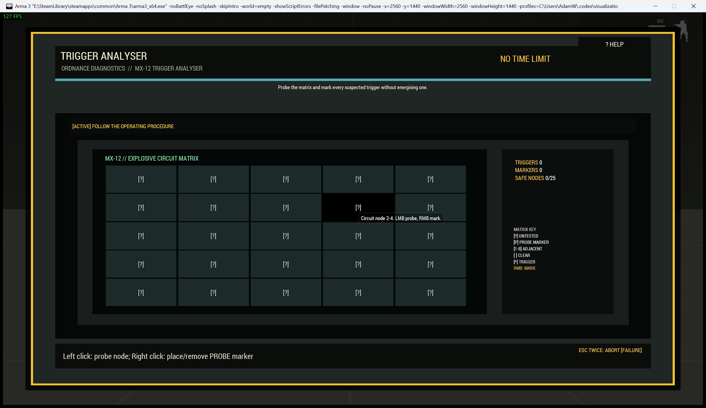

# Ordnance Diagnostic Tablet

The `minesweeper` procedure presents a portable explosive-circuit matrix. Use it for trigger diagnosis, minefield control units, fault maps, or damaged electronics.

| Operating card | Active tablet |
|---|---|
|  |  |

## Operator procedure

Left-click a cell to probe it. Right-click to place or remove a marker. The first probe is always safe; empty areas flood open. Numbers report adjacent triggers. Probe every safe cell to succeed. Probing a trigger reveals the complete fault map and fails the attempt.

Markers, numbers, trigger symbols, counters, and explicit reveal states ensure the board does not depend on colour.

## Difficulty and configuration

Larger matrices and more triggers increase the deduction workload. Hard and expert profiles add operating limits.

```sqf
[this, "minesweeper", createHashMapFromArray [
    ["difficulty", "standard"],
    ["actionTitle", "Inspect Detonator Matrix"]
]] call Waldo_fnc_MiniGameInteractionSetup;
```

Valid configuration: `[size(4-8,5), mineCount(5), timeLimit(0), title("TRIGGER ANALYSER")]`.

[Shared state and mission integration](Waldos-Mini-Games-Interaction-Challenges#authoritative-lifecycle-and-mission-state)
