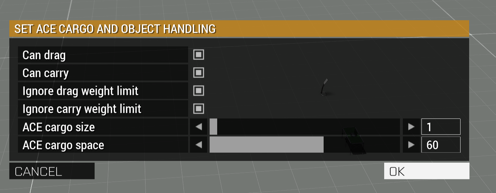

# Physical cargo

> **Use this page when:** mounting an ACE-carried crate or prop visibly on a vehicle.

Physical cargo lets a player carry a crate with ACE and leave it visibly attached to a vehicle.
ACE and CBA are required. The feature is on by default through `Waldo_PhysicalCargo_Enable` in
`MissionConfig/logisticsConfig.sqf`.

## Try it in a mission

1. Place an inventory crate and a vehicle in Eden. You do not need an Init call on the vehicle.
2. Start the mission and use ACE **Carry** on the crate.
3. Aim at the part of the vehicle where you want it and release the crate. WMP keeps its carried
   position and shows a notification when the mount succeeds.
4. Use ACE **Carry** again to remove it. Release it on clear ground or on another vehicle.

Release the crate away from a vehicle for an ordinary ground drop. ACE's menu can still load it
inside ACE Cargo. [Crate options](Supply-Transfers) can change that loading choice for a registered
crate. WMP reports a failed physical mount after it releases the object, leaving the crate available.

WMP registers placed `ReammoBox_F` crates at startup and its own issued crates when they spawn.
WMP-issued inventory crates remain draggable and carryable when you turn off physical mounting.
The feature flag controls mounting and seat effects. WMP applies drag and carry choices through
ACE's public setters for current and joining players.

For another non-weapon prop, put this in the prop's Eden **Init** field:

```sqf
[this] call Waldo_fnc_PhysicalCargoRegister;
```

The same call works in `initServer.sqf` with a named object in place of `this`. WMP also asks ACE to
make that prop carryable.

WMP rejects visible mounts for static weapons after an HMG flipped a test vehicle. Players can
still use ACE Carry, ground drop and ACE Cargo for static weapons. WMP has no working weapon mount
or gun-entry action.

Place ZEN **Physical Cargo - Eligibility** directly on a carryable prop or crate to allow future
mounts, disallow them or inspect the current state. The module rejects static weapons, vehicles,
aircraft and boats. It cannot change eligibility while the object has a mount. ACE Carry and Cargo
remain available.

ZEN **ACE Cargo - Set Object Handling** changes ACE handling on an existing crate or vehicle.
Place it directly on the object. **Can drag** and **Can carry** control those ACE interactions.
Leave the weight-limit overrides off unless you intend to carry an object ACE considers too heavy.



The dialog opens with the object's current ACE handling and cargo values. It does not reuse the
values from the last object you edited. Pressing OK without changing anything leaves the object
alone. To discard edits in the form, press Cancel and reopen the module on the object.

**ACE cargo size** controls whether ACE can load the object into another cargo holder. Set `-1`
to disable loading. **ACE cargo space** sets how much ACE Cargo the object can hold; `0` disables
storage. The module applies a size or space value only if you change it from the starting value.
It does not turn on WMP physical mounting or supply transfers. WMP rounds values selected in this
ZEN module to whole ACE cargo units; opening the dialog alone does not round an existing value.

If an object already holds ACE cargo, ACE may report its free space rather than its total capacity.
Leave the space value untouched unless you want to set a new total.

The equivalent server-side script call is:

```sqf
[myCrate, -1, 2, true, true] call Waldo_fnc_SetCargoAttributes;
```

The second argument is ACE storage space, the third is this object's ACE loading size, and the
last two turn on dragging and carrying. Use `nil` for space or size to keep the current value.

WMP-issued supply and medical crates, including crate compositions, follow the global flag. WMP
also registers quartermaster wheels and tracks for the physical carry-release path.

Registered, portable non-starter objects get a loading size when their class has none. WMP
preserves a mission maker's explicit ACE size or handling choice.

Quartermaster and WMP ZEN-spawned crates have ACE Drag and Carry enabled, ignore ACE's drag/carry
weight limits, and take one ACE cargo slot. The starter-crate call disables Drag, Carry and ACE
loading on that object, even if its class inherits those abilities. The ZEN ACE Cargo module can
still change a chosen object's settings explicitly.

WMP ZEN crate spawning leaves the crate class's ACE storage space unchanged. A crate with enough
storage space can hold another ACE cargo object, including a vehicle. Set its space to `0` if the
crate should only store ordinary inventory items.

ACE calculates loading time from the object being loaded. If a specific object needs a shorter
time, set `ace_cargo_delay` on that object in its Init field, for example
`this setVariable ["ace_cargo_delay", 5, true];`. This changes ACE loading time for that object;
WMP's crate size does not change a vehicle's own loading time. See the
[ACE Cargo framework](https://ace3.acemod.org/wiki/framework/cargo-framework).

WMP accepts a valid contact hit on land, air or sea vehicles. Test each crate and vehicle combination
in Arma before using it in a mission.

## Seats covered by cargo

`Waldo_PhysicalCargo_BlockSeats` defaults to `true`. A crate placed over a verified seat blocks
that seat until a player carries the crate away. Clear seats remain available. A vehicle needs no
seat coordinates or extra Init call.

On the first mount of each vehicle class, the server reads its model seat points and seat config,
then caches the match. If a mod does not expose enough information, WMP leaves that seat available
and logs the reason.

An experienced mission maker can supply a measured override for an unusual model:

```sqf
myTruck setVariable ["Waldo_PhysicalCargo_SeatPoints", [
    ["CARGO", 0, [0.8, -0.5, 0.6]],
    ["TURRET", [1, 0], [-0.8, -0.5, 0.6]]
], true];
```

The coordinates and turret path above only show the data shape. WMP locks a free cargo seat with
`lockCargo`, or a matched FFV person-turret with `lockTurret`, when its point lies inside the
mounted object's oriented footprint. Edge contact does not lock a seat. WMP tracks multiple crates
covering one seat and releases only its own locks. The older `[cargoIndex, point]` form still works
for cargo seats.

Only use an override after checking the exact model. An incorrect point can lock the wrong seat
or leave a covered seat open. The **Supply Transfers and Physical Cargo Example** uses the normal
automatic lookup. Its Prowler Init field contains only supply-transfer registration.

## Server and network cost

The seat-proxy lookup runs on the server on the first mount of each vehicle class. WMP caches the
result. Each later mount checks the crate against that vehicle's stored seat points. Opening the ACE
menu does not run this lookup.

Ordinary entity deletion releases the mount's owned seat locks at once. A three-second server
monitor catches deletion paths that do not emit that event, checks active mounts and verifies their
owned seat locks. A missing lock gets at most three retries per vehicle owner. Successful locks
generate no repeat traffic. The work grows with active mounts, not players.

Mount and unmount events go to current clients. WMP keeps the full mount list on the server and
sends it once to a joining player on request. It does not rebroadcast the growing list for every
crate.

Seat-point, seat-lock and restore bookkeeping stays on the server. The server sends seat-lock
changes to the vehicle owner, where Arma applies them. Object attachment state and actual seat
locks still synchronize through Arma. These are design limits, not measured byte or frame-time
figures. Test a heavily loaded mission on its intended server before relying on them.

## Carrying cargo away

Stand near the crate and the intended contact point. Stop the vehicle before mounting. If the click
misses the vehicle or the mount fails, the crate drops and remains available. Use ACE **Carry** to
remove mounted cargo, then put it on clear ground or another vehicle. A direct unload could leave the
crate inside the vehicle model, so there is no player **Unload physical cargo** action. Server scripts
can call `Waldo_fnc_PhysicalCargoUnmountServer` when they need a checked ground position.

WMP attaches the object at its carried position and restores its previous simulation and collision
state after pickup or ACE Cargo loading. The empty-crate delete action clears a mount before deleting
the crate. Other deletion methods use the deletion listener and monitor fallback to release seats.
WMP uses ACE's carry-release callback only when the expected
function and action ID exist. That callback is not public ACE API. If ACE changes it, native ACE
release stays available until WMP supports the new callback.

Check the behaviour on every crate and vehicle class your mission uses. A first ACE-menu opening
may briefly hitch. The cause has not been confirmed. Do not assume a static-weapon
mount is safe: WMP deliberately does not offer one.

## See also

- [Supply Transfers](Supply-Transfers)
- [Logistics System, Starter Crates and Quartermaster](Logistics-System,-Starter-Crates-And-Quartermaster)
- [Vehicle Recovery and Squad Rally Points](Vehicle-Recovery-And-Squad-Rallies)
- [Mission Configuration Reference](Mission-Configuration-Reference)

<!-- WMP-WIKI-NAV -->
---
[Wiki home](Home) · [Quickstart](Quickstart-Guide) · [Feature index](Feature-Tutorials)
