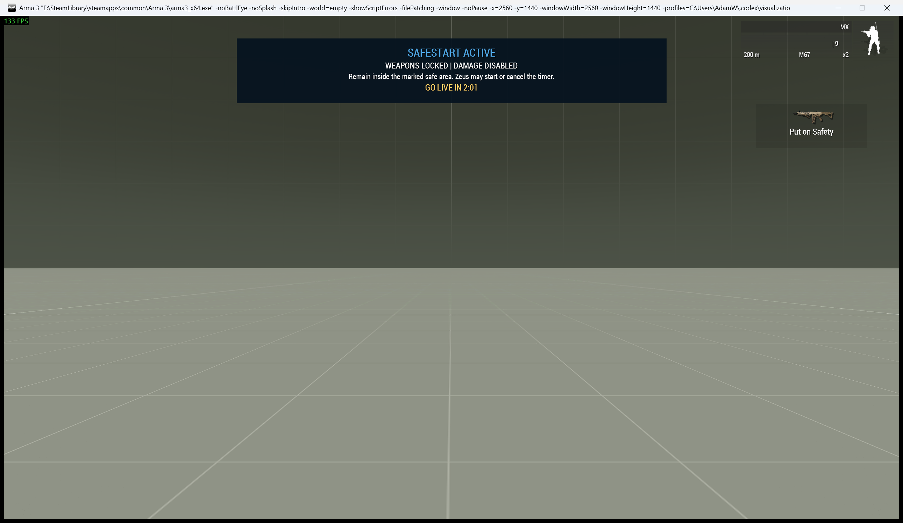

# Safestart

> **Use this page when:** you need to protect mission preparation, run a countdown, go live, or diagnose stuck protection.

_Associated Files: `initServer.sqf`, `MissionScripts\MissionFlowAndUi\safeStart.sqf`, `safeStartTimer.sqf`, `safeStartApply.sqf`, `Waldo_fnc_SafeStart`, `Waldo_fnc_SafeStartTimer`_




Safestart freezes every player at the start of a mission so people can load in, sort kit and get organised before anyone can shoot. It is the reversible mirror of the [ENDEX](ENDEX-Script-&-Custom-End-Screen) script — turn it on to hold the mission, lift it to go live.

While Safestart is active:
* All weapons are placed on safe (ACE), and **every** shot, thrown grenade, launcher round, underbarrel round and crewed vehicle weapon round is deleted — firing just shows a red **"Hold Fire!"** prompt.
* Players take and deal **no damage**.
* Players are **confined to a safe zone** (they are pulled back if they try to leave).
* An on-screen **banner** is shown, with a live go-live countdown when a timer is running.
* **JIP and respawning players are re-frozen automatically**, so latecomers can't skip it.

The freeze runs on its own variables, so it never clashes with ENDEX.

## Auto-start (the default)

Safestart starts automatically from `initServer.sqf`. Its server-owned defaults are exposed in `MissionConfig\ServerFeatureDefaults.sqf`:

```sqf
missionNamespace setVariable ["Waldo_SafeStart_Confine", true, true];   // safe-zone confinement on/off
missionNamespace setVariable ["Waldo_SafeStart_Radius", 75, true];      // per-player radius (metres)
missionNamespace setVariable ["Waldo_SafeStart_ZoneMarker", "", true];  // marker name for one shared zone (else per-player anchor)
missionNamespace setVariable ["Waldo_SafeStart_AutoStart", true, true]; // false = start the mission live (no safestart)
```

| Variable | Default | Purpose |
|---|---|---|
| `Waldo_SafeStart_AutoStart` | `true` | `false` = mission starts live, no Safestart. |
| `Waldo_SafeStart_Confine` | `true` | `false` = freeze weapons/damage but let players move freely. |
| `Waldo_SafeStart_Radius` | `75` | Confinement radius in metres around each player's start position. |
| `Waldo_SafeStart_ZoneMarker` | `""` | Set to a marker name to confine everyone to **one shared zone** (the marker's position and size) instead of a per-player radius. |
| `Waldo_SafeStart_GoLiveHintDuration` | `12` | Seconds the manual/timed go-live explanation remains visible. |

## Going live & the scripting API

The API is **server-authoritative** — it is safe to call from a client, it forwards to the server for you.

```sqf
[true]  call Waldo_fnc_SafeStart;        // activate the freeze
[false] call Waldo_fnc_SafeStart;        // go live (admin overrule; also cancels any countdown)
[300]   call Waldo_fnc_SafeStartTimer;   // go live automatically in 300 seconds (banner shows the clock)
```

`Waldo_fnc_SafeStartTimer` makes sure Safestart is active, then publishes the go-live time so every player's banner shows a live countdown, and lifts the freeze automatically when it expires. Calling it again restarts/extends the timer. An admin can overrule a running countdown at any time with `[false] call Waldo_fnc_SafeStart`.

SafeStart and ENDEX own separate fire handlers, damage state and ACE safety changes. If ENDEX is active when the countdown finishes, the SafeStart restriction is removed but ENDEX remains in force; the transition panel says so explicitly. Use `[] call Waldo_fnc_ENDEXReset` only when the exercise should resume.

The active banner explicitly says when no countdown exists, so a manual hold is
not mistaken for a stuck timer. When Safestart is lifted, the longer go-live
notice explains that weapon, damage and confinement protections have ended and
whether the change was manual or timer-driven.

Only one SafeStart panel exists at a time. Starting or changing a countdown updates the existing panel rather than opening another one. The panel waits for the mission title sequence to finish, uses safe-zone padding, and displays configured seconds as `MM:SS` for players.

## Diagnostics

```sqf
private _report = [] call Waldo_fnc_SafeStartGetDiagnostics;
```

The report identifies whether the code is loaded, whether SafeStart is active, its published go-live time, the local protection loop, and the current HUD state. The same checks appear in `[] call Waldo_fnc_RunDiagnostics` under mission flow.

## Zeus usage

Three modules are registered under **WMP Mission Flow** in the Zeus menu:

| Module | Action |
|---|---|
| **Safestart - Activate** | Freezes the mission (`[true] call Waldo_fnc_SafeStart`). |
| **Safestart - Go Live (Lift)** | Lifts the freeze and cancels any countdown. |
| **Safestart - Start Go-Live Countdown** | Prompts for a number of seconds, then starts the auto go-live timer. Player HUDs display the remaining time as `MM:SS`. |

[Waldos Mission Pack Zeus Modules](Waldos-Mission-Pack-Zeus-Modules) are covered separately.

## Examples

```sqf
// Hold the mission, then auto go-live 5 minutes later from a trigger:
[300] call Waldo_fnc_SafeStartTimer;

// Confine everyone to one shared zone called "startzone" instead of per-player radii (initServer.sqf):
missionNamespace setVariable ["Waldo_SafeStart_ZoneMarker", "startzone", true];

// Ship a mission that starts live, but keep the Zeus modules available to freeze later (initServer.sqf):
missionNamespace setVariable ["Waldo_SafeStart_AutoStart", false, true];
```

## See also

* [ENDEX Script & Custom End Screen](ENDEX-Script-&-Custom-End-Screen) — the matching mission-end freeze
* [Mission Configuration Reference](Mission-Configuration-Reference) — all `initServer.sqf` fields
* [Waldos Mission Pack Zeus Modules](Waldos-Mission-Pack-Zeus-Modules)

<!-- WMP-WIKI-NAV -->
---
[Wiki home](Home) · [Quickstart](Quickstart-Guide) · [Feature index](Feature-Tutorials)
