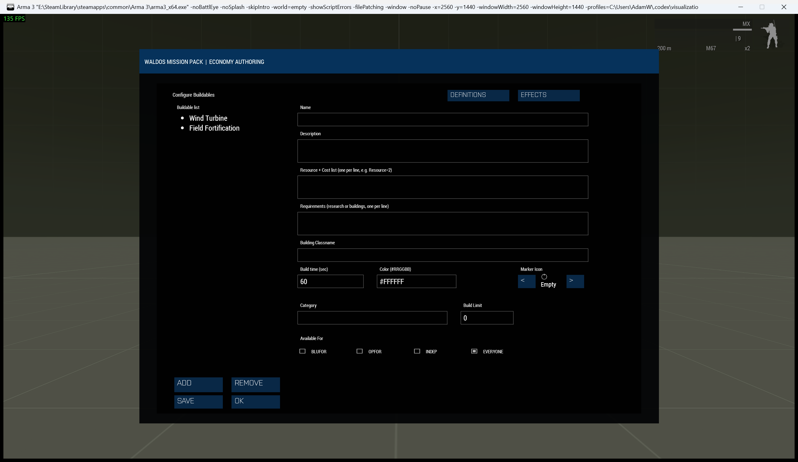

# Economy Build System

> **Use this page when:** you need construction vehicles, build catalogues, placement, upgrades, limits, or RADAR.

_Associated Files: MissionScripts\EconomySystems\Build\ (`Waldo_fnc_EcoBuild_*`)_



The Build System is the most intricate part of [Waldos Economy Systems](Waldos-Economy-Systems). It lets players construct and upgrade buildings that shape the economy — producing [resources](Waldos-Economy-Systems-Resource-System), raising storage, speeding up [research](Waldos-Economy-Systems-Research-System)/construction, or revealing the enemy.

## Construction vehicles

Players build using a **construction vehicle**. From it they pick a building from the catalog, place it, and a construction job runs to completion. Designate any vehicle as a construction vehicle in Zeus (**WMP Economy Systems → Build → Spawn Construction Vehicle**), from script, or via an editor-placed vehicle's init field:

```sqf
[this] call Waldo_fnc_EcoBuild_registerConstructionVehicle;
```

> **The source vehicle is consumed.** Confirming placement converts the
> construction vehicle into the construction site; it is not returned after the
> job. The action is labelled **Deploy + Consume**, the placement view repeats
> the warning, and a timed completion notice names the vehicle that was
> converted. Reusable construction bases are not consumed and do not show this warning.

The same build controls are available through ACE and a vanilla interaction.
All player Economy dialogs are constrained to the protected screen area and use
the WMP operations-console visual treatment.

## Defining buildings

Each build entry is rich — you give it a **name**, **description**, **cost**, **requirements**, **build time**, the **classname** to spawn, and any of: **resource production** (resource + amount + interval), **storage capacity** boosts, **research-** and **construction-speed** boosts, **upkeep**, **side availability**, **build limits**, and upgrade targets.

In Zeus: **Build → Configure Buildings** (a tabbed editor for the many fields). From script, trailing fields are optional and default sensibly:

```sqf
// [name, desc, costRows, requirementList, buildTime, icon, color, false, "ClassName", produceResource, produceAmount, produceInterval, ...]
[[
    ["Generator",    "Produces electricity over time.",  [["Money", 15]], [],              90, "", "", false, "Land_PowerGenerator_F", "Electricity", 2, 20],
    ["Supply Depot", "Raises supply storage.",           [["Money", 10]], [],              60, "", "", false, "Land_Cargo_HQ_V1_F"],
    ["Radar Station","Reveals enemy units periodically.",[["Money", 25]], ["Logistics I"], 120,"", "", false, "Land_Radar_Small_F"]
]] call Waldo_fnc_EcoBuild_setBuildCatalog;
```

* `costRows` — `[["Resource", amount], ...]`  ·  `requirementList` — research/building names that must exist first
* Production: a building can output a resource every N seconds while it stands (subject to the side's storage cap).
* Boosts: buildings can shorten research and construction times, and raise resource storage caps.
* Upkeep: a building can consume resources over time to keep running.

### Full row reference

Every field beyond `name` is optional and defaults sensibly if omitted — the example above only sets the first 12:

| # | Field | Default | Purpose |
|---|---|---|---|
| 0 | `name` | required | Catalogue key and display name |
| 1 | `description` | `""` | Shown in the build menu |
| 2 | `costRows` | `[]` | `[["Resource", amount], ...]` |
| 3 | `requirements` | `[]` | Research/building names that must exist first |
| 4 | `buildTime` | `60` | Seconds, minimum `1` |
| 5 | `icon` | resource default icon | Menu icon path |
| 6 | `color` | resource default colour | Menu accent colour |
| 7 | *(reserved)* | `false` | Internal "already built" flag — leave as `false` in a catalogue definition |
| 8 | `className` | `""` | `CfgVehicles` classname spawned on completion |
| 9 | `produceResource` | `""` | Resource name this building generates while standing |
| 10 | `produceAmount` | `0` | Amount produced per interval |
| 11 | `produceInterval` | `0` | Seconds between production ticks |
| 12 | `researchSpeedBoost` | `0` | Reduces research time mission-wide while standing |
| 13 | `buildSpeedBoost` | `0` | Reduces construction time mission-wide while standing |
| 14 | `detectorRange` | `0` | Non-zero makes this a RADAR building (see below) |
| 15 | `upkeepCosts` | `[]` | `[["Resource", amount], ...]` consumed per upkeep interval |
| 16 | `upkeepInterval` | `0` | Seconds between upkeep charges |
| 17 | `storageRows` | `[]` | `[["Resource", capacityBoost], ...]` |
| 18 | `upgradeTo` | `""` | Name of the catalogue entry this building can upgrade into |
| 19 | `buildLimit` | `0` | Maximum standing count per side; `0` is unlimited |
| 20 | `availability` | `["ALL"]` | Sides allowed to build this entry |
| 21 | `category` | `""` | Optional menu grouping label |

## Upgrades & limits

Buildings can be **upgraded** into a higher tier, and you can cap how many of a building a side may have (**build limits**). Availability can be restricted per side.

## RADAR

A building flagged as a RADAR periodically reveals enemy units on the map for its side — a powerful, upkeep-worthy structure for map awareness.

## See also

* [Resource System](Waldos-Economy-Systems-Resource-System) — production and storage feed the Build System.
* [Setup & Configuration](Waldos-Economy-Systems-Setup-And-Configuration)

<!-- WMP-WIKI-NAV -->
---
[Wiki home](Home) · [Quickstart](Quickstart-Guide) · [Feature index](Feature-Tutorials)
