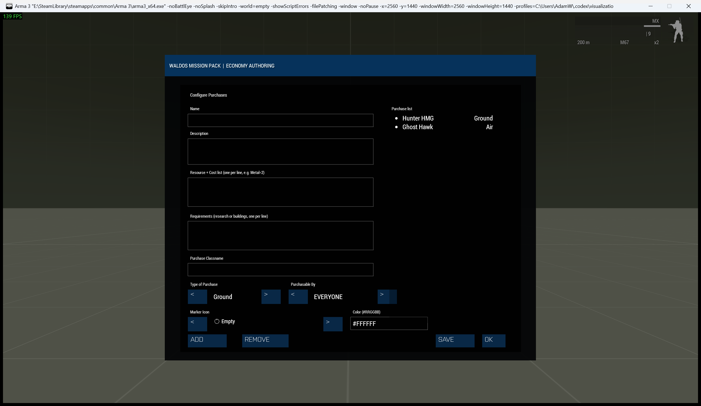
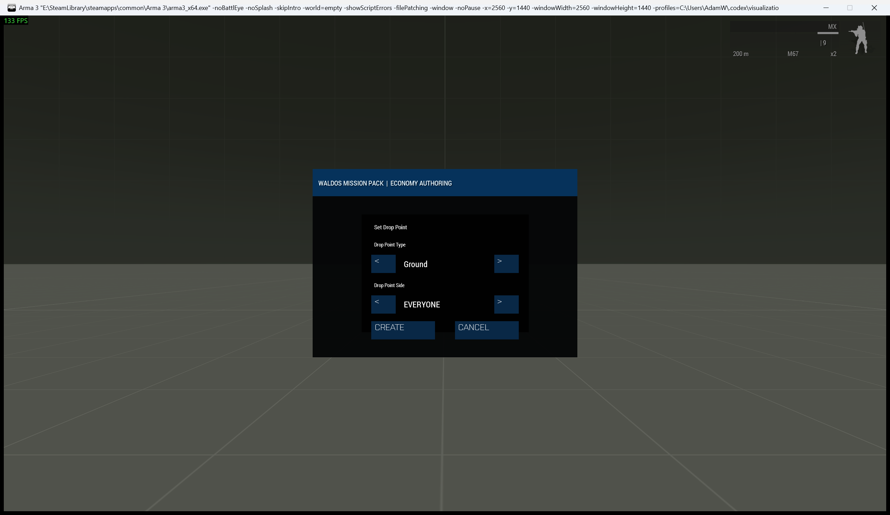

# Economy Buy System

> **Use this page when:** you need purchase terminals, delivery points, prices, requirements, or vehicle categories.

_Associated Files: MissionScripts\EconomySystems\Buy\ (`Waldo_fnc_EcoBuy_*`)_

| Purchase catalog | Delivery-point setup |
|---|---|
|  |  |

The Buy System lets players **purchase vehicles** with their side's [resources](Waldos-Economy-Systems-Resource-System), once any [research](Waldos-Economy-Systems-Research-System) or [building](Waldos-Economy-Systems-Build-System) requirements are met. Purchases are made at a terminal and the vehicle appears at a configured drop point.

## Quick setup: purchase terminals

`Waldo_fnc_EcoBuy_registerTerminal` takes one existing laptop Object and has no
documented return value. The server publishes its terminal tag; interface clients,
including joiners, install their own interaction. Use the Eden Init call below on
the object itself.

Players buy from a **purchase terminal** (`Land_Laptop_unfolded_F`) via the ACE interaction menu. Spawn one in Zeus (**WMP Economy Systems → Buy → Spawn Purchase Terminal**), from script, or designate an editor-placed laptop:

```sqf
[this] call Waldo_fnc_EcoBuy_registerTerminal;   // in a placed Land_Laptop_unfolded_F's init field
```

## Drop points

| `Waldo_fnc_EcoBuy_createDropPoint` argument | Type | Default or rule |
| --- | --- | --- |
| Position | Position Array | Function default `[0,0,0]`; provide a real location. |
| Type | String | `"Ground"` if omitted; choose `Ground`, `Air` or `Naval`. |
| Direction | Number, degrees | `0` if omitted. |
| Side | String | `"ANY"` if omitted, or a side key such as `WEST`. |

The server returns a drop-point ID String. A client call forwards the request
and has no immediate ID. Author fixed drop points in
`MissionConfig/economyConfig.sqf` or place them with the ZEN module.

A **drop point** is where purchased vehicles spawn, typed by **Ground**, **Air** or **Naval** so each kind of vehicle appears somewhere sensible (a motor pool, a helipad, a dock). Drop points can be restricted by side. Create them in Zeus (**Buy → Create Drop Point**) or from script:

```sqf
// [position, "Ground"/"Air"/"Naval", direction, "ANY"/side]
[getMarkerPos "motorpool", "Ground", 0, "ANY"] call Waldo_fnc_EcoBuy_createDropPoint;
[getMarkerPos "helipad_1", "Air", 90, "WEST"] call Waldo_fnc_EcoBuy_createDropPoint;
```

When a vehicle is purchased, the system finds an available drop point of the matching type for the buyer's side and spawns the vehicle there.

## Settings: defining purchases

| Purchase row field | Type | Default or rule |
| --- | --- | --- |
| Name | String | Required unique catalogue name. |
| Description | String | `""` if omitted. |
| Costs | Array of `[resource name String, amount Number]` rows | `[]` if omitted. |
| Requirements | Array of completed research/building-name Strings | `[]` if omitted. |
| Vehicle class | `CfgVehicles` classname String | `""` if omitted; provide a valid class for a usable purchase. |
| Type | String | `"Ground"` if omitted; matches a drop-point type. |
| Availability | String | `"EVERYONE"` if omitted, or one supported side. |
| Icon | Image-path String | WMP default resource icon if omitted. |
| Colour | Hex-colour String | WMP default resource colour if omitted. |

`Waldo_fnc_EcoBuy_setPurchaseCatalog` takes one Array of these rows,
replaces the published catalogue and returns nothing. Define the resources
and any named requirements before authoring the purchase rows.

Each purchase entry has a **name**, **description**, **cost**, **requirements**, the vehicle **classname**, a **type** (Ground/Air/Naval, which selects the drop point), and a **side** restriction (`EVERYONE` or a specific side).

In Zeus: **Buy → Configure Purchases**. From script:

```sqf
// [name, description, costRows, requirementList, "ClassName", "Ground"/"Air"/"Naval", "EVERYONE"/side]
[[
    ["Transport Truck", "A cargo truck.",      [["Money", 10]], ["Vehicle Depot"], "B_Truck_01_transport_F", "Ground", "EVERYONE"],
    ["Transport Heli",  "A light helicopter.", [["Money", 25]], ["Air Doctrine"],  "B_Heli_Light_01_F",      "Air",    "WEST"]
]] call Waldo_fnc_EcoBuy_setPurchaseCatalog;
```

* `costRows`: `[["Resource", amount], ...]`
* `requirementList`: completed research or built structures that gate the purchase

## If a purchase is refused

Check that the purchase belongs to the active catalogue, the side meets its resource and research requirements, and a matching drop point exists. A ground purchase cannot use an air-only drop point. The player-facing failure notice and [Mission Diagnostics](Mission-Diagnostics) help separate an unaffordable order from a placement problem.

## See also

* [Setup & Configuration](Waldos-Economy-Systems-Setup-And-Configuration)

<!-- WMP-WIKI-NAV -->
---
[Wiki home](Home) · [Quickstart](Quickstart-Guide) · [Feature index](Feature-Tutorials)
