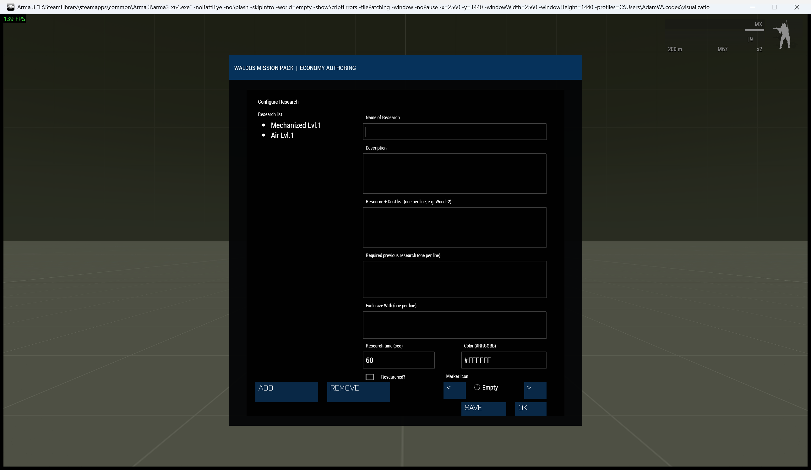

# Economy Research System

> **Use this page when:** you need research centres, technology catalogues, costs, prerequisites, or exclusions.

_Associated Files: MissionScripts\EconomySystems\Research\ (`Waldo_fnc_EcoResearch_*`)_



The Research System adds a **tech tree** to [Waldos Economy Systems](Waldos-Economy-Systems). A side spends [resources](Waldos-Economy-Systems-Resource-System) at a Research Center to unlock research, which in turn gates what they can [build](Waldos-Economy-Systems-Build-System) and [buy](Waldos-Economy-Systems-Buy-System).

## The Research Center

| Call | Input type | Return and locality |
| --- | --- | --- |
| `Waldo_fnc_EcoResearch_spawnResearchCenter` | Position Array, default `[0,0,0]` in the function | Returns the created Object on the server; a forwarded client call returns `objNull`. Supply a real position. |
| `Waldo_fnc_EcoResearch_registerCenter` | Existing research-centre Object | Tags it on the server and installs the local action for players. No documented return value. The public object tag is available to JIP clients. |

Research is conducted at a Research Center (`Land_Research_HQ_F`). Players interact with it through the ACE menu to view available research and start it. Place one in Zeus (**WMP Economy Systems → Research → Spawn Research Center**), from script, or designate an editor-placed `Land_Research_HQ_F`:

```sqf
[getMarkerPos "research_1"] call Waldo_fnc_EcoResearch_spawnResearchCenter;   // spawn
// or, in a placed Land_Research_HQ_F's init field:
[this] call Waldo_fnc_EcoResearch_registerCenter;
```

## Defining research

| Research row field | Type | Default or rule |
| --- | --- | --- |
| Name | String | Required unique research name. |
| Description | String | `""` if omitted. |
| Costs | Array of `[resource name String, amount Number]` rows | `[]` if omitted. |
| Requirements | Array of research/building-name Strings | `[]` if omitted. |
| Time | Number, seconds | `60` if omitted; normalized to at least `1`. |
| Icon | Image-path String | WMP's default resource icon if omitted. |
| Colour | Hex-colour String | WMP's default resource colour if omitted. |
| Already researched | Boolean | `false` if omitted. |
| Mutually exclusive names | Array of research-name Strings | `[]` if omitted. |

`Waldo_fnc_EcoResearch_setResearchCatalog` takes one Array of these rows.
It replaces the published catalogue and returns nothing. Put authored calls
in `MissionConfig/economyConfig.sqf`, after the resources they cost exist.

Each research entry has a **name**, **description**, **cost** (resource rows), **requirements** (other research/buildings that must exist first), and a **time** in seconds. You can also make entries **mutually exclusive**, so choosing one locks out another (doctrine choices).

In Zeus: **Research → Configure Research**. From script, use this entry shape. Trailing fields are optional:

```sqf
// [name, description, costRows, requirementList, timeSeconds, icon, color, alreadyResearched, exclusiveWithList]
[[
    ["Logistics I",   "Basic supply handling.",        [["Money", 10]], [],              60],
    ["Vehicle Depot", "Unlocks transport purchases.",  [["Money", 20]], ["Logistics I"], 120],
    ["Doctrine: Armor", "Heavy armor focus.",          [["Money", 30]], ["Logistics I"], 120, "", "", false, ["Doctrine: Air"]]
]] call Waldo_fnc_EcoResearch_setResearchCatalog;
```

* `costRows`: `[["Resource", amount], ...]`
* `requirementList`: `["Some Research", "Some Building"]` (names of completed research or built structures)
* `exclusiveWithList`: names of research that cannot coexist with this one

## How it plays

1. A player (or [Ground Command](Waldos-Economy-Systems-Ground-Command-And-Tools)) selects a research at the Research Center.
2. If the side can afford it and the prerequisites are met, the cost is deducted and the research enters progress.
3. After the time elapses it completes for that side, unlocking anything that required it.

Build-system structures can grant **research-speed boosts**, shortening research time while they stand.

## If research cannot start

Check that a Research Center exists for the side, the side can afford every named resource, and all required research or buildings are complete. An entry in `exclusiveWithList` can block an otherwise affordable choice. The progress timer begins only after the server accepts the request.

## See also

* [Build System](Waldos-Economy-Systems-Build-System): buildings that require research and boost research speed.
* [Setup & Configuration](Waldos-Economy-Systems-Setup-And-Configuration)

<!-- WMP-WIKI-NAV -->
---
[Wiki home](Home) · [Quickstart](Quickstart-Guide) · [Feature index](Feature-Tutorials)
