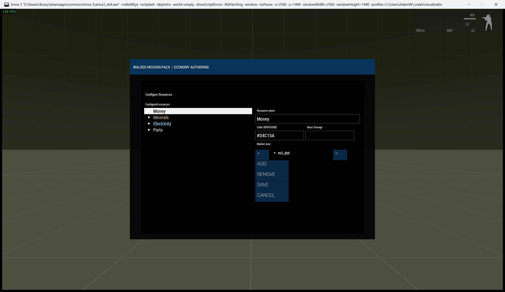
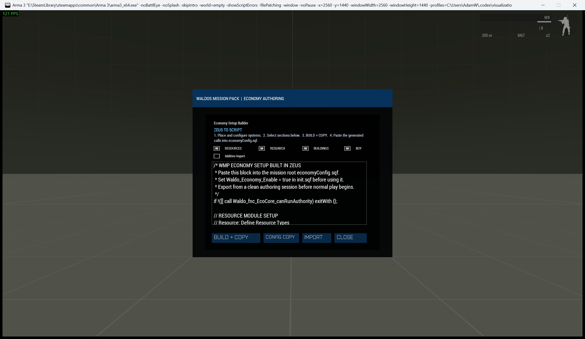

# Economy Setup and Configuration

> **Use this page when:** you are enabling the Economy, selecting a preset, or exporting a Zeus-authored setup to script.

_Associated Files: `init.sqf`, `initServer.sqf`, `MissionConfig\economyConfig.sqf`, `Waldo_fnc_EcoInit`, `Waldo_fnc_EcoCore_applyMakerConfig`_

| Catalog authoring | Mission setup builder |
|---|---|
|  |  |

This page covers every way to enable and configure [Waldos Economy Systems](Waldos-Economy-Systems) — from a one-line toggle to a fully hand-authored economy baked into the mission file. Everything here is applied once on the server and broadcast, so **JIP and rejoining players inherit the configured economy automatically**.

> **Zeus Enhanced is required for the in-Zeus menu.** Every operator action is a **ZEN custom module** in the Zeus module list under the single category **"WMP Economy Systems"**. Modules are named `System - Action`, so the tutorial paths on the other pages map directly: e.g. "**WMP Economy Systems → Resource → Configure Resources**" is the module **`Resource - Configure Resources`**, and "**Research → Create Research Center**" is **`Research - Create Research Center`**. Placement modules (create crate/zone/research center, spawn building/vehicle/laptop, set drop point) spawn at the point where you drop the module on the map. Without ZEN the economy still runs on the server, but there is no in-Zeus menu.

## 1. Enable the suite

It is **off by default**, so missions that don't use it pay no performance cost. Turn it on whichever way is easiest for you:

* **Easiest — drop a composition** (Eden compositions list, category _Waldos Mission Pack Compositions_). No scripting, no init fields:
  * `[WMP] Waldos Economy Systems - Low / Medium / High Preset` — boots the suite **and** loads a ready-made economy. This is the fastest way to a playable economy; start with **Low** if you're new to it.
  * `[WMP] Waldos Economy Systems` — boots the suite only, so you configure it yourself (live in Zeus or via the files below).
* **Or set one flag in `init.sqf`:**
  ```sqf
  Waldo_Economy_Enable = true;   // init.sqf then runs: [] spawn Waldo_fnc_EcoInit;
  ```

Place only one Economy Systems object per mission.

## 2. Quick configuration (`initServer.sqf`)

A commented block in `initServer.sqf` exposes the quick options:

```sqf
// A bundled preset:
missionNamespace setVariable ["Waldo_Economy_Preset", "MEDIUM", true];   // LOW | MEDIUM | HIGH
missionNamespace setVariable ["Waldo_Economy_PresetSides", [["WEST","NATO"],["EAST","CSAT"],["GUER","AAF"]], true];

// ...or a full configuration exported from the Zeus "Export" tool (wins over a preset):
missionNamespace setVariable ["Waldo_Economy_ConfigString", "PASTE_EXPORT_STRING_HERE", true];

// Optional perf toggle (freeze config refreshes once you finish configuring):
missionNamespace setVariable ["Waldo_Economy_CommitmentMode", true, true];
```

Preset complexities: **LOW** (a single resource + research) → **HIGH** (a full Factorio-style economy). Faction catalogue keys for `Waldo_Economy_PresetSides`: `NATO`, `CSAT`, `AAF`, `SYNDIKAT`, `GENERIC`.

## 3. Full hand-authoring (`MissionConfig\economyConfig.sqf`)

For complete control, edit **`MissionConfig\economyConfig.sqf`** — the dedicated authoring file (registered as `Waldo_fnc_EcoMakerSetup`, run once on the server after any preset/config string). It ships with a complete worked example you can switch on (`_useExample = true;`) and copy.

Define catalogs and place world objects with the server-side helpers:

```sqf
// Resources: [name, "#hexColour", "iconPath", storageCap]  (-1 = unlimited)
["Supplies", "#D4C15A", call Waldo_fnc_EcoResource_getDefaultResourceIcon, -1] call Waldo_fnc_EcoResource_addResourceType;

// Research / Buildings / Purchases: pass an array of entries
[[ ["Logistics I", "Basic supply handling.", [["Supplies", 10]], [], 60] ]] call Waldo_fnc_EcoResearch_setResearchCatalog;
[[ ["Generator", "Produces fuel.", [["Supplies", 15]], [], 90, "", "", false, "Land_PowerGenerator_F", "Fuel", 2, 20] ]] call Waldo_fnc_EcoBuild_setBuildCatalog;
[[ ["Transport Truck", "A cargo truck.", [["Supplies", 10]], ["Vehicle Depot"], "B_Truck_01_transport_F", "Ground", "EVERYONE"] ]] call Waldo_fnc_EcoBuy_setPurchaseCatalog;

// Place world objects (e.g. at a marker):
[getMarkerPos "eco_zone_1", "Supply Field", 30, [["Supplies", 2, 500]], "NONE", 30] call Waldo_fnc_EcoResource_createResourceZone;
[getMarkerPos "eco_research_1"] call Waldo_fnc_EcoResearch_spawnResearchCenter;
```

**Build it in Zeus, then bake it into the mission:** use the normal Resource, Research, Construction and Purchasing Zeus modules to configure and place the system visually. Then open **Configuration: Build Mission Setup**, select the systems to include, and press **BUILD + COPY**. The generated, pre-filled public setup calls are copied to the clipboard immediately. Paste them into `MissionConfig\economyConfig.sqf`; no array editing or manual argument reconstruction is required.

The generated recipe preserves the authoring result: resource definitions, initial side balances and marker visibility; research, construction and purchasing catalogues; and the current resource zones, uncollected resource crates, research centres, construction sources, completed economy buildings, delivery points and purchase terminals. Calls are emitted in dependency order so the catalogues exist before their placed equipment is created.

Export from a clean authoring session before normal play begins. The exporter records the current world positions, directions, classes and economy tags; it is not intended to turn an in-progress campaign save into mission source. Keep `Waldo_Economy_Enable = true` in `init.sqf`.

Use **Config Copy** only when you need the older portable catalogue string for `Waldo_Economy_ConfigString` in `initServer.sqf` or for **Import**. Older exported configuration strings remain compatible.

The builder explains the copy-and-paste workflow inside the display. It owns mouse and keyboard focus while open and does not dismiss unrelated WMP notifications.

## 4. Designate editor-placed objects (no mod needed)

Arma can only add true Eden "Systems" modules from a **loaded addon**, and WMP is a mission framework, not a mod. Instead, place a normal object in Eden and turn it into an economy object from its **init field**:

| Place this object | Put this in its init field |
|---|---|
| `Land_Research_HQ_F` | `[this] call Waldo_fnc_EcoResearch_registerCenter;` |
| `Land_Laptop_unfolded_F` | `[this] call Waldo_fnc_EcoBuy_registerTerminal;` |
| any vehicle | `[this] call Waldo_fnc_EcoBuild_registerConstructionVehicle;` |

## Order of application

`Waldo_fnc_EcoInit` → `Waldo_fnc_EcoCore_applyMakerConfig` runs, in order: a config string (if set) **or** a preset, then commitment mode, then `MissionConfig\economyConfig.sqf`. So you can build on a preset or define everything from scratch. It only runs on the server authority, exactly once.

<!-- WMP-WIKI-NAV -->
---
[Wiki home](Home) · [Quickstart](Quickstart-Guide) · [Feature index](Feature-Tutorials)
