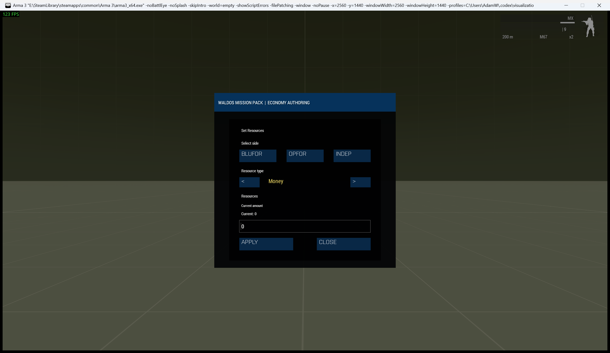

# Waldos Economy Systems

> **Use this page when:** you are choosing, enabling, or troubleshooting the Resource, Research, Build, Buy, and Command systems.

_Associated Files: MissionScripts\EconomySystems\ (the `Waldo_fnc_Eco*` functions), `Waldo_fnc_EcoInit`, `MissionConfig\economyConfig.sqf`_



Waldos Economy Systems is a **Zeus, RTS-style economy suite** built into the pack. It lets you run a resource economy, a tech tree, base construction, and a vehicle store entirely from inside Zeus — no scripting needed by the operator, and no Eden work needed beyond turning it on. It works for any curator, including a player-controlled Zeus.

> **Requires Zeus Enhanced (ZEN).** Every action is a ZEN custom module under the **"Waldos Economy Systems"** category in the Zeus module list. Without ZEN loaded the economy still runs on the server (income, research, production, player requests), but there is no in-Zeus authoring menu. ZEN is already a common dependency for the pack's other Zeus modules.

This is the hub page. Each system has its own tutorial:

## Feature pages

* **[Setup & Configuration](Waldos-Economy-Systems-Setup-And-Configuration)** — enable it, presets, config strings, the `MissionConfig\economyConfig.sqf` authoring file, editor designation helpers, and compositions.
* **[Resource System](Waldos-Economy-Systems-Resource-System)** — define resources, crates, capturable income zones, storage limits.
* **[Research System](Waldos-Economy-Systems-Research-System)** — a Research Center, custom research, costs, prerequisites, exclusivity.
* **[Build System](Waldos-Economy-Systems-Build-System)** — buildings, construction, upgrades, production, upkeep, RADAR.
* **[Buy System](Waldos-Economy-Systems-Buy-System)** — purchase vehicles, drop points, requirements.
* **[Ground Command & Tools](Waldos-Economy-Systems-Ground-Command-And-Tools)** — trusted-player permissions, Commitment mode, Export/Import, Purge.

## What it is at a glance

| System | What players do |
|---|---|
| Resource | Collect resource crates and capture zones that passively generate resources for their side. |
| Research | Spend resources at a Research Center to unlock research (with prerequisites). |
| Build | Construct and upgrade buildings that produce resources, store them, boost speeds, or reveal enemies. |
| Buy | Purchase vehicles at a terminal; they appear at a configured drop point. |

## Quick start — pick your effort level

You never have to touch a script to use this suite. Pick the path that suits you:

* **Easiest (≈30 seconds, no scripting, no Eden setup).** In the Eden Editor, open the **Compositions** list (category _Waldos Mission Pack Compositions_) and drag in
  **`[WMP] Waldos Economy Systems - Low / Medium / High Preset`**. That single object boots the suite **and** loads a ready-made, balanced economy for NATO/CSAT/AAF. Play the mission — it just works. (Start with **Low** if you're new to it.)
* **Live in Zeus (one flag).** Set `Waldo_Economy_Enable = true;` in `init.sqf` (or drop the plain `[WMP] Waldos Economy Systems` composition). Open Zeus — a new **Waldos Economy Systems** root appears in the tree, and you build the whole economy live with menus and dialogs. No editor objects required.
* **Bake in your own (full control).** Configure it live in Zeus, hit **Export** to copy a config string, and paste it into `Waldo_Economy_ConfigString` in `initServer.sqf` — or hand-author everything in `MissionConfig\economyConfig.sqf`. It then loads automatically every time the mission runs, for every player including JIP.

> **Tip:** place only **one** Economy Systems object (composition or flag) per mission.

See **[Setup & Configuration](Waldos-Economy-Systems-Setup-And-Configuration)** for the full walkthrough of all three paths.

## For mission makers

Use a preset composition for the quickest setup, configure the system live through its ZEN modules, or call the public setup functions from `MissionConfig\economyConfig.sqf`. The **Build Mission Setup** tool converts the current Zeus-authored catalogs and placed economy objects into ordered, pre-filled setup calls that can be pasted into the mission.

## Diagnostics

```sqf
private _report = [] call Waldo_fnc_EcoCore_getDiagnostics;
```

The report covers enablement, server initialization, all four catalogs, invalid building or purchase class names, runtime registries, and the active authoring display's layout findings. It is also consumed by `[] call Waldo_fnc_RunDiagnostics`.

## Architecture (for scripters)

All functionality is registered under `class Waldo` in `WaldosFunctions.sqf` across six sub-namespaces:

| Namespace | Purpose |
|---|---|
| `Waldo_fnc_EcoCore_*` | Shared infrastructure — Zeus menu/dialogs, parsing, commitment mode, curator registration |
| `Waldo_fnc_EcoResource_*` | Resources, zones, crates, markers, storage |
| `Waldo_fnc_EcoResearch_*` | Research catalog, queue, requirements |
| `Waldo_fnc_EcoBuild_*` | Build catalog, construction, upgrades, production |
| `Waldo_fnc_EcoBuy_*` | Vehicle purchases and drop points |
| `Waldo_fnc_EcoCommand_*` | Ground Command authority |

The bootstrap is `Waldo_fnc_EcoInit`. Global state uses the `WaldoEco<System>_` variable prefix. World objects are recognised by class: resource crate `Land_PlasticCase_01_medium_F`, Research Center `Land_Research_HQ_F`, purchase terminal `Land_Laptop_unfolded_F`, plus tagged construction vehicles.

<!-- WMP-WIKI-NAV -->
---
[Wiki home](Home) · [Quickstart](Quickstart-Guide) · [Feature index](Feature-Tutorials)
