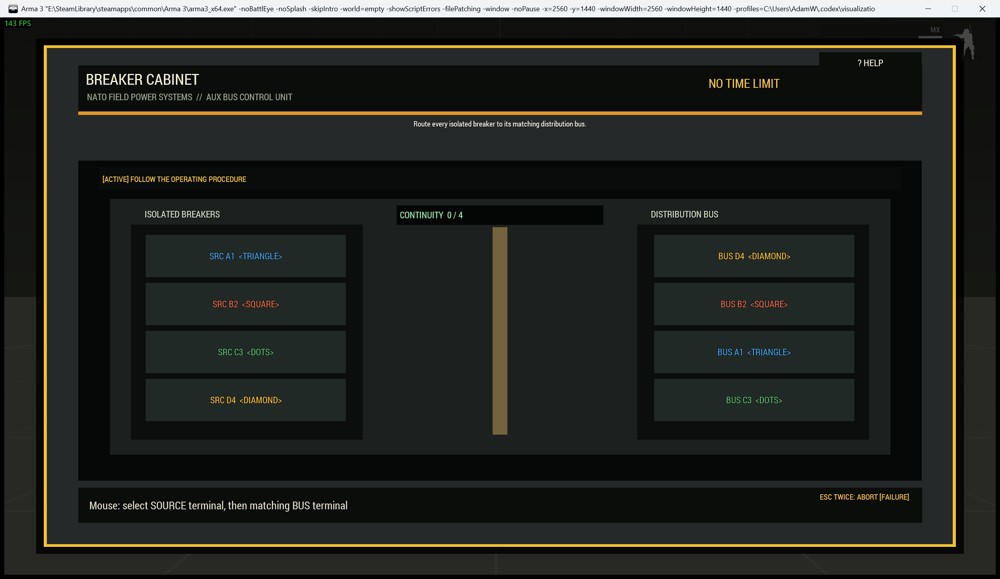

# Field Equipment Interaction Procedures

> **Use this page when:** you need the shared setup, state, accessibility, customization, or controls for WMP interaction procedures.

_Associated Files: `MissionScripts\InteractionsMinigames\`, `Waldo_fnc_MiniGameInteractionSetup`, `Waldo_fnc_MiniGameInteraction`, `Waldo_fnc_MiniGameInteractionTableSetup`, `Waldo_fnc_BombDefuseSetup`, `Waldo_fnc_MiniGameChallenge`, `Waldo_fnc_MiniGameEquipmentGallery`, `Waldo_fnc_MiniGameEquipmentGallerySetup`_




Field equipment procedures are single-player interactions that resolve to pass or fail. They use the
same callback contract as the earlier interaction challenges, but the player-facing presentation is
diegetic: players inspect an EOD controller, maintenance hatch, radio, manifold, access terminal, or
other physical equipment instead of opening a generic minigame window.

They register on first use and work even when the seated table-game engine is disabled.

## One-line Eden setup

Place this in an object's Eden **Initialization** field:

```sqf
[this, "repair"] call Waldo_fnc_MiniGameInteractionSetup;
```

Available procedure ids are `wirecut`, `minesweeper`, `keypad`, `lockpick`, `circuit`, `repair`,
`radiotune`, `pressure`, `sequence`, and `commandinput`.

## Equipment guides

Each guide explains what the operator sees, how the procedure flows, its controls, difficulty profiles, configuration order, and mission integration.

For live explosives, use [Bomb Defusal](Bomb-Defusal). It applies the explosive consequence to any procedure below rather than replacing that procedure with a separate interface.

| Procedure | Equipment guide |
|---|---|
| `wirecut` | [EOD Controller](Interaction-Procedure-EOD-Controller) |
| `minesweeper` | [Ordnance Diagnostic Tablet](Interaction-Procedure-Ordnance-Diagnostics) |
| `keypad` | [Industrial Access Terminal](Interaction-Procedure-Access-Terminal) |
| `lockpick` | [Cutaway Lock Cylinder](Interaction-Procedure-Lock-Cylinder) |
| `circuit` | [Breaker and Relay Cabinet](Interaction-Procedure-Breaker-Cabinet) |
| `repair` | [Maintenance Hatch](Interaction-Procedure-Maintenance-Hatch) |
| `radiotune` | [Tactical Communications Unit](Interaction-Procedure-Communications-Unit) |
| `pressure` | [Hydraulic Control Manifold](Interaction-Procedure-Hydraulic-Manifold) |
| `sequence` | [Secure Control Sequence](Interaction-Procedure-Control-Sequence) |
| `commandinput` | [Tactical Command Uplink](Interaction-Procedure-Command-Uplink) |

The helper supplies a suitable action, equipment identity, icon, and balanced configuration. Failure
allows another attempt by default; success consumes the interaction. ACE is used when available;
the vanilla action fallback reads exactly the same state. It broadcasts:

Feature integrations set `installAction` to `false` so the framework stores only the procedure,
authority conditions, and callbacks. The feature keeps its original action and visibility rules;
its optional procedure flag changes only what happens after that action is selected. With the flag
off, the original operation runs immediately. With it on, **Disable Jammer**, **Disable AA System**,
**Access Tactical Display**, or **Package for Recovery** launches the configured challenge and the
original operation runs only after success. The generic **Field Equipment** category remains the
default for standalone equipment procedures.

| Variable | Meaning |
|---|---|
| `Waldo_MG_InteractionState` | `IDLE`, `RUNNING`, `SUCCESS`, or `FAILURE`. |
| `Waldo_MG_InteractionResult` | Stable result array described below. |
| `Waldo_MG_InteractionComplete` | `true` after the latest successful attempt. |
| `Waldo_MG_InteractionFailed` | `true` after the latest failed attempt; reset on success. |
| `Waldo_MG_<id>Complete` | Procedure-specific completion flag, such as `Waldo_MG_repairComplete`. |

## Authoritative lifecycle and mission state

The server grants one exclusive attempt before the procedure opens. It validates that the equipment
is active, unconsumed, not already running, and within its configured interaction distance. The
accepted actor receives an owner-bound attempt ID; stale, duplicate, wrong-actor, and post-reset
results are ignored. The default exclusive-lock timeout is 600 seconds and can be changed with
`["lockTimeout", seconds]` or the equivalent hashmap entry.

The lifecycle is `IDLE -> RUNNING -> SUCCESS` or `IDLE -> RUNNING -> FAILURE`. A terminal state
remains available to triggers, ACE conditions, and JIP clients until the next accepted attempt enters
`RUNNING` or the server resets the equipment. Detailed outcome codes are `SUCCESS`, `FAILURE`,
`TIMEOUT`, `ABORTED`, and `ABANDONED`; the last covers death, disconnect, unexpected display loss,
and lock expiry.

`Waldo_MG_InteractionResult` always has this shape:

```sqf
[state, outcomeCode, reason, challengeId, actor, attemptId, startedAt, finishedAt]
```

Use the side-effect-free helpers in ACE conditions, triggers, or ordinary mission code:

```sqf
private _state = [_equipment] call Waldo_fnc_MiniGameInteractionGetState;
private _succeeded = [_equipment, "SUCCESS"] call Waldo_fnc_MiniGameInteractionStateIs;
private _result = [_equipment] call Waldo_fnc_MiniGameInteractionGetResult;
private _reason = _result get "reason";
```

The result hashmap contains `state`, `outcomeCode`, `reason`, `challengeId`, `actor`, `attemptId`,
`startedAt`, `finishedAt`, and `raw`.

### ACE-first follow-up actions

ACE follow-up conditions can expose unlock, open, repair, or diagnostic actions only after the
required result:

```sqf
private _successCondition = {
    params ["_target"];
    [_target, "SUCCESS"] call Waldo_fnc_MiniGameInteractionStateIs
};

private _failureCondition = {
    params ["_target"];
    [_target, "FAILURE"] call Waldo_fnc_MiniGameInteractionStateIs
};
```

To make another object's action depend on this equipment, store the equipment on that action target
or in a mission variable and pass the referenced equipment to `MiniGameInteractionStateIs`. Hide a
conflicting ACE action during operation by requiring that its state is not `RUNNING`.

Equivalent vanilla `addAction` condition strings are:

```sqf
"[_target, 'SUCCESS'] call Waldo_fnc_MiniGameInteractionStateIs"
"!([_target, 'RUNNING'] call Waldo_fnc_MiniGameInteractionStateIs)"
```

### Callbacks and immediate CBA events

Callbacks still run on the server. Their first three arguments have not changed; new code can read
the authoritative array from argument four:

```sqf
private _onSuccess = {
    params ["_object", "_actor", "_success", "_result"];
    // State and result variables are already broadcast here.
};
```

For event-driven integrations, register once on every machine that needs the notification:

```sqf
[
    "Waldo_MG_InteractionStateChanged",
    {
        params ["_object", "_state", "_result"];
    }
] call CBA_fnc_addEventHandler;
```

The server writes state/result and compatibility variables first, emits the global event second, and
runs the authoritative result callback third. Events fire for `RUNNING`, terminal state, and reset.
Past events are not replayed; JIP code reads the broadcast variables instead.

### Retry, consumption, abandonment, and reset

Preset interactions retry failure by default (`retryOnFailure = true`) and become inactive after
success unless `repeatable = true`. Generic `oneShot = true` interactions are consumed by their first
terminal result. Confirmed Escape remains failure and, for bomb setups, still follows the configured
detonation callback. Death, disconnect, unexpected display closure, or lock timeout resolves as
`FAILURE`/`ABANDONED` and follows the same retry and callback rules.

Reset on the server with:

```sqf
[_equipment, true, false] call Waldo_fnc_MiniGameInteractionReset;
```

Arguments are `[object, reenableAction, forceRunningReset]`. A normal reset returns `false` rather
than interrupting a running procedure. A forced reset invalidates its attempt ID, returns the object
to `IDLE`, clears completion/custom flags, and optionally re-enables the action. Any late client
completion is then rejected.

## Immersive equipment profiles

Use a hashmap when customizing the equipment identity. Layout positions are template-owned so mission
overrides cannot break the interface.

```sqf
[
    this,
    "circuit",
    createHashMapFromArray [
        ["preset", "generatorBreaker"],
        ["actionTitle", "Inspect Generator Cabinet"],
        ["manufacturer", "NATO FIELD POWER SYSTEMS"],
        ["model", "AUX BUS CONTROL UNIT"],
        ["title", "GENERATOR BUS B"],
        ["skin", "hazard"],
        ["briefing", "GENERATOR ISOLATION PROCEDURE"],
        ["objective", "Route each isolated breaker to its matching distribution bus."],
        ["controls", "Select a labelled breaker, then its matching bus."],
        ["hint", "Match both the terminal symbol and its engraved label."],
        ["statusText", "[LIVE] AUXILIARY BUS ENABLED"],
        ["successText", "Bus synchronized. Generator output restored."],
        ["config", [4, 3, 0, "GENERATOR BUS B"]]
    ]
] call Waldo_fnc_MiniGameInteractionSetup;
```

Presentation keys are `preset`, `actionTitle`, `manufacturer`, `model`, `title`, `skin`, `objective`,
`briefing`, `activation`, `controls`, `hint`, `statusText`, `successText`, `failureText`, `timeoutText`,
`abortText`, `icon`, `texturePreset`, `texture`, and `soundProfile`. Operational keys remain `difficulty`, `config`, `successVariable`, `failureVariable`,
`retryOnFailure`, `repeatable`, `distance`, `lockTimeout`, `condition`, `onSuccess`, and `onFailure`.

`skin` accepts `default`, `olive`, `charcoal`, `sand`, `naval`, or `hazard`. `soundProfile` accepts
`equipment` or `silent`. Unknown values safely fall back to `default` and `equipment`. Textures are
disabled by default: the complete interface is drawn from Arma controls, procedural shapes, seams,
fasteners, instruments and labels. An optional material image is drawn beneath that interface and
never replaces semantic state symbols. Mission makers cannot provide raw control positions or
semantic colours, so presentation changes cannot remove protected contrast or break the layout.

### Curated difficulty profiles

Set `difficulty` to `easy`, `standard`, `hard`, or `expert`. These profiles adjust meaningful workload
such as component count, tolerance, hold duration, mistake allowance, or memory length. They do not
make labels smaller or remove accessibility cues. An explicit `config` always takes precedence and
the object publishes `Waldo_MG_Preset_Difficulty` as the selected name or `custom`.

```sqf
[
    this,
    "sequence",
    createHashMapFromArray [["difficulty", "easy"]]
] call Waldo_fnc_MiniGameInteractionSetup;
```

| Procedure | Easy | Standard | Hard | Expert |
|---|---|---|---|---|
| `wirecut` | 4 looms / 1-point order / 35 s | 5 / 2-point / 30 s | 6 / 3-point / 30 s | 6 / 4-point / 25 s |
| `minesweeper` | 4x4 / 3 triggers | 5x5 / 5 | 7x7 / 10 / 90 s | 8x8 / 15 / 75 s |
| `keypad` | 3 digits / 9 attempts | 4 / 8 | 5 / 8 / 90 s | 6 / 9 / 75 s |
| `lockpick` | 2 pins / broad bind windows | 3 / normal windows | 5 / narrow / 60 s | 6 / very narrow / 45 s |
| `circuit` | 3 pairs / 5 mistakes | 4 / 3 | 5 / 2 / 60 s | 6 / 1 / 45 s |
| `repair` | 3 bolts / 1 turn / 5 mistakes | 4 / 2 / 3 | 5 / 3 / 2 | 6 / 4 / 1 |
| `radiotune` | 2 broad carriers | 3 normal carriers | 4 narrow carriers | 5 precision carriers |
| `pressure` | 2 lines / broad bands | 3 / normal bands | 4 / narrow bands | 4 / precision bands |
| `sequence` | 3 pads / 3 stages / 1.05 s | 4 / 4 / 0.85 s | 5 / 5 / 0.85 s | 6 / 6 / 0.85 s |
| `commandinput` | 3 commands / 2 packets / 4 faults | 4 / 3 / 3 | 5 / 4 / 2 | 6 / 5 / 1 |

### Presentation option reference

| Key | Type | Purpose |
|---|---|---|
| `preset` | String | Selects a curated equipment identity and terminology. |
| `actionTitle` | String | Text shown on the world interaction, such as `Service Cooling Manifold`. |
| `icon` | String | ACE interaction icon path. Vanilla `addAction` ignores the icon. |
| `manufacturer` / `model` | String | Engraved equipment identification plate. |
| `title` | String | Main equipment faceplate title. Hashmap setups only; legacy arrays retain their old meaning. |
| `briefing` | String | Heading on the pre-operation procedure card and help card. |
| `objective` | String | The operational goal presented before and during use. |
| `activation` | String | Contextual start control; the timer does not begin before this is pressed. |
| `controls` | String | Short footer and procedure-card control reminder. |
| `hint` | String | Longer procedure note shown by the help control. |
| `statusText` | String | Initial live-equipment status after activation. |
| `successText` / `failureText` | String | Final explicit result wording. |
| `timeoutText` / `abortText` | String | Operating-window and confirmed-abort wording. |
| `skin` | String | Curated casing palette: `default`, `olive`, `charcoal`, `sand`, `naval`, or `hazard`. |
| `texturePreset` | String | Optional included material: `none`, `olive`, `charcoal`, `naval`, or `sand`; default `none`. |
| `texture` | String | Optional vanilla or mission texture path. An explicit path takes precedence over `texturePreset`. |
| `textureOpacity` | Number | Decorative overlay opacity, clamped to `0..0.32`; default `0.14`. |
| `soundProfile` | String | `equipment` for built-in UI cues or `silent`. |

All string values are type-checked. Invalid types are ignored, unknown skins use the equipment
default, unknown sound profiles use `equipment`, unknown texture presets use `none`, and texture
opacity is clamped. Generated textures remain decorative: interactive controls, captions, patterns,
labels, seams, fasteners and state symbols are separate Arma controls drawn above them.

### Included original material textures

WMP includes four original generated material sheets, converted to power-of-two 1024px JPEGs for
compact mission distribution. They contain no operational text or gameplay state and are not loaded
unless the mission maker explicitly opts in.

| Olive equipment casing | Charcoal breaker steel |
|---|---|
|  |  |
| Naval communications aluminium | Sand maintenance hatch |
|  |  |

Opt in to an included material independently of the equipment skin:

```sqf
[
    this,
    "radiotune",
    createHashMapFromArray [
        ["skin", "naval"],
        ["texturePreset", "naval"],
        ["textureOpacity", 0.12]
    ]
] call Waldo_fnc_MiniGameInteractionSetup;
```

Leaving `texturePreset` as `none` and `texture` as `""` uses only the procedural interface. Skins
change safe casing and accent colours but never enable a bitmap automatically.

All wording fields are optional. Keep `controls` short enough for the footer and use `hint` for the
longer help-card explanation. Gameplay remains controlled by `difficulty` or an overriding `config`;
changing a title or skin does not change timing, callbacks, or success rules.

Legacy option arrays remain compatible; in a legacy array, `title` continues to mean the world action
text. Use a hashmap for the new equipment faceplate fields.

### Curated presets

| Procedure | Default equipment | Additional presets |
|---|---|---|
| `wirecut` | Rugged EOD controller | `vehicleCharge`, `navalCharge` |
| `minesweeper` | Ordnance diagnostic tablet | `mineDetector` |
| `keypad` | Industrial access terminal | `safeController`, `bunkerTerminal` |
| `lockpick` | Cutaway cylinder | `safeLock`, `vehicleIgnition` |
| `circuit` | Generator breaker cabinet | `communicationsRelay`, `facilityFusePanel` |
| `repair` | Open maintenance hatch | `armourPlate`, `fieldGenerator` |
| `radiotune` | NATO receiver | `antennaController`, `distressBeacon` |
| `pressure` | Hydraulic manifold | `fuelRegulator`, `coolantControl` |
| `sequence` | Secure control console | `authorizationConsole` |
| `commandinput` | Tactical command uplink | `supportTerminal` |

## Procedures and controls

Every procedure first opens an integrated field operating card. The timer starts only after its
contextual activation button is pressed. A compact control reminder remains visible, and
**Field Procedure** reopens the complete instructions.

| Id | Equipment and operation | Config | Controls |
|---|---|---|---|
| `wirecut` | EOD controller: isolate the identified lead | `[wireCount(3-6,5), timeLimit(20), title, verificationLevel(1-4,derived)]` | Cross-check the requested bay/connector/pattern/continuity/bus; select loom; operate cutter |
| `minesweeper` | Trigger analyser: survey an explosive matrix | `[size(4-8,5), mineCount(5), timeLimit(0), title]` | Left reveal; right flag |
| `keypad` | Access terminal: recover its authorization code | `[digits(3-6,4), maxGuesses(6), timeLimit(0), title]` | Mouse or numbers; Backspace; Enter |
| `lockpick` | Cutaway cylinder: set pins at the shear line | `[pins(1-6,3), period(2.8), zoneWidth(0.16), timeLimit(0), title]` | Tension -/+ or Left/Right; Set Pin or Space |
| `circuit` | Breaker cabinet: route terminals to matching buses | `[pairs(3-6,4), maxMistakes(3), timeLimit(0), title]` | Select labelled left and right terminals |
| `repair` | Maintenance hatch: calibrate and apply a torque wrench | `[boltCount(3-6,4), precision(1-4,2), maxMistakes(3), timeLimit(30), title]` | Select bolt; match target Nm with buttons/wheel/arrows; apply torque |
| `radiotune` | Communications unit: acquire and hold carriers | `[channels(1-5,3), tolerance(0.02-0.15,0.05), holdTime(1), timeLimit(30), title]` | Drag or wheel dial; buttons; Left/Right |
| `pressure` | Manifold: stabilize all coupled lines | `[valves(2-4,3), difficulty(1-3,1), settleTime(2), timeLimit(45), title]` | Select valve with mouse or 1-4; wheel/buttons/Left/Right |
| `sequence` | Secure console: repeat authorization signals | `[pads(3-6,4), rounds(1-8,4), speed(0.25-1.5,0.85), timeLimit(0), title]` | Mouse or number keys 1-6; `R` replays once per stage |
| `commandinput` | Tactical uplink: enter displayed directional packets | `[baseLength(3-8,4), rounds(1-6,3), maxMistakes(1-6,3), timeLimit(45), title]` | Arrow keys or labelled direction controls |

The **Interaction Examples Showcase** composition places all ten procedures side by side purely for
visual/preset comparison. For a real gameplay outcome wired to each one via `onSuccess`/`onFailure` -
completing a task, unlocking a vehicle, populating a supply crate, an EMP burst, a vehicle repair,
toggling a radio jammer, real player damage, a side-wide notification, and a signal tracker - see the
nine dedicated `*_Interaction_Example` compositions (Minesweeper, Keypad, Lockpick, Circuit, Repair,
RadioTune, Pressure, Sequence, CommandInput; `wirecut` is covered by
[Bomb Defusal](Bomb-Defusal) instead). Each copies directly onto your own object - swap the
`onSuccess`/`onFailure` code and the `nearestObject` classname for whatever your mission needs.

### Bomb defusal (`wirecut`)

The EOD controller presents physical bay, connector, insulation, continuity and routed-bus readings.
Difficulty increases the number of independent readings in the isolation order from one to four;
it does not add artificial confirmation presses. Inspecting a row selects it without committing the
outcome. A continuity probe must acquire the selected loom's hidden live/open/pulse reading before
the cutter interlock releases. Harder orders therefore require testing candidate looms and
correlating acquired continuity with connector, insulation and routed-bus labels. The guarded cutter
reports the selected and tested bay before cutting.
Cutting the correct lead succeeds; the wrong lead or expired timer fails immediately. Wire colour is
supplementary. Existing `[wireCount, timeLimit, title]` configurations remain valid; the optional
fourth `verificationLevel` argument gives mission makers explicit control over 1-4 point orders.

### Ordnance diagnostics (`minesweeper`)

The tablet presents an explosive-circuit matrix. The first probe is always safe, empty regions flood
open, right click toggles explicit probe markers, and a loss reveals the complete fault map. Mine and
flag counters remain visible. This procedure uses the established `[size, mineCount, timeLimit,
title]` order.

### Industrial access terminal (`keypad`)

Players correlate three visible sources: the authorized digit bank, a recovered prefix record, and a
backup tail stored in reverse order. Reading Source B right-to-left and appending it to Source A always
reconstructs the generated code, so the procedure is never an unbounded combination guess. Digits
outside the bank and already-used digits are disabled. Attempt audit still identifies exact slots and
misplaced digits as a recovery aid. The procedure locks out when attempts or time expire.

### Cutaway lock cylinder (`lockpick`)

The view exposes pins, pick, shear line, set window, tension tool, binding state, and cylinder
progress. First adjust tension until the readout reports `[BIND]`; it always also says `LOW` or `HIGH`
when adjustment is needed. Then operate Set Pin (or Space) while the moving pick is inside the
labelled `[SET]` window. Each successful pin changes the required tension, while marker speed remains
predictable throughout the cylinder. Difficulty profiles deliberately select slower-to-faster sweep
periods of 3.2, 2.8, 2.3, and 1.9 seconds; pin count, window width, and time limit provide the other
difficulty pressure. Explicit state labels preserve monochrome readability.

### Breaker and relay cabinet (`circuit`)

Select a labelled terminal on the isolated side and then its matching distribution bus. Terminal
symbols and labels duplicate colour coding; routed cable paths and connected states remain visible.
The maximum-mistake and timer settings are mission controlled.

### Maintenance hatch (`repair`)

Each bolt carries an engraved target in newton metres. Select a bolt, calibrate the wrench with its
`-5`, `-1`, `+1`, and `+5` controls, mouse wheel, or arrow keys, then operate **APPLY TORQUE**. The
yellow wrench marker and green target marker move on the same scale, while the numeric readout says
`LOW`, `HIGH`, or `[OK] MATCH`. Applying outside the configured tolerance records a mistake. The
legacy second positional argument now selects calibration precision from 1-4, preserving the config
shape while replacing the former circular-drag mechanic.

### Communications tuning (`radiotune`)

Rotate the tuning dial with pointer-captured dragging, use its mouse wheel, use the TUNE buttons, or
press Left/Right until the needle is inside the labelled target band. Hold the signal for the
configured time. Each acquired carrier advances the channel selector. The numeric frequency, target
band, needle, lock wording, and explicit signal-status text provide redundant feedback.

### Pressure manifold (`pressure`)

Each valve changes its own gauge and couples into neighbouring lines. Bring all gauges inside their
labelled safe bands and hold the system for the settle period. Every gauge reports `LOW`, `SAFE`, or
`HIGH` alongside its needle position; difficulty narrows the permitted band without changing input
behavior. Click or press 1-4 to select a line, then use its wheel/buttons or Left/Right to operate the
valve.

### Secure control sequence (`sequence`)

Observe progressively longer control-lamp sequences and reproduce them by mouse or number keys. A
three-count **EYES ON CONTROL PANEL** warning precedes every playback. During observation the input
buttons are disabled and each signal is drawn on a separate non-interactive cue layer, so pointer
hover cannot obscure or imitate the recorded pattern. The
console explicitly separates **OBSERVE** and **YOUR INPUT** phases, captions every signal with its
number and symbol, records entered signals, and permits one deliberate replay per stage with `R` or
the labelled replay control. Reduced-motion mode keeps the same readable cue duration while removing
abrupt animation; it never accelerates playback.
Pads carry numbers, shapes, and names in addition to illumination. Playback, player-input, accepted,
and rejected stages are explicitly labelled. A zero time limit keeps the procedure round-driven.

### Tactical command uplink (`commandinput`)

Read the command packet from left to right and enter each highlighted direction with the keyboard
arrow keys or the large labelled direction controls. Packet cells use large ASCII arrow symbols;
the active-command readout and every input control pair that symbol with its direction word, so the
prompt never depends on colour. Correct commands are marked `[OK]`; an incorrect
direction records a fault and resets only the current packet. Later rounds add commands, while the
difficulty profile controls packet length, rounds, fault allowance, and operating time. The original
tactical-terminal presentation uses no third-party branding or assets.

Colour is never the only signal: wires have numbers and patterns, terminals have symbols, sequence
pads have names and shapes, gauges show LOW/HIGH/SAFE labels, and results include explicit symbols
and text. Press Escape once for a visible warning and again within three seconds to confirm failure.
For bomb defusal, confirmed abort retains the configured detonation behavior.

## Accessibility preferences

Presentation preferences are local and do not alter mission difficulty or timers:

```sqf
[
    ["highContrast", true],
    ["colourblind", true],
    ["largeText", true],
    ["strongOutlines", true],
    ["reducedMotion", true],
    ["audioCaptions", true]
] call Waldo_fnc_MiniGameAccessibility;
```

Call `[] call Waldo_fnc_MiniGameAccessibility` to read the current preferences.

| Preference | Effect |
|---|---|
| `highContrast` | Uses a darker casing and bright protected accent while retaining equipment identity. |
| `colourblind` | Uses colourblind-safe semantic hues in addition to existing symbols and wording. |
| `largeText` | Enlarges equipment, briefing, result, and dynamically opened help text within safe limits. |
| `strongOutlines` | Adds a clear perimeter to the protected equipment inspection area. |
| `reducedMotion` | Shortens completion transitions without changing timing or difficulty. |
| `audioCaptions` | Retained for profile compatibility. Equipment states already use meaningful text and symbols; literal sound/debug captions are not drawn. |

Preferences are stored in the local player profile and therefore do not require mission-maker or
server configuration. Colour is never the only carrier of meaning, even when `colourblind` is false.

## Object lifecycle, callbacks, and locality

The setup helper keeps world-state ownership server-side while equipment UI runs only for the local
actor. Success and failure callbacks receive `[object, actor, result]` on the server after the
broadcast completion variables are updated.

```sqf
[
    this,
    "pressure",
    createHashMapFromArray [
        ["actionTitle", "Stabilize Coolant Loop"],
        ["preset", "coolantControl"],
        ["config", [4, 2, 3, 60, "REACTOR COOLANT LOOP"]],
        ["successVariable", "coolingRestored"],
        ["failureVariable", "coolingServiceFailed"],
        ["retryOnFailure", true],
        ["repeatable", false],
        ["condition", {alive _this}],
        ["onSuccess", {
            params ["_equipment", "_engineer"];
            _equipment animateSource ["valve_source", 1];
            [format ["Cooling restored by %1", name _engineer]] remoteExec ["systemChat", 0];
        }],
        ["onFailure", {
            params ["_equipment", "_engineer"];
            _equipment setVariable ["requiresSupervisor", true, true];
        }]
    ]
] call Waldo_fnc_MiniGameInteractionSetup;
```

`retryOnFailure` defaults to `true`; `repeatable` defaults to `false`. A successful non-repeatable
procedure removes access for every client. The shared active-equipment guard prevents two different
procedures from stacking on one player, and exactly-once resolution prevents duplicate callbacks.

Every field-equipment setup exposes both the nested ACE interaction and a vanilla
`addAction` discoverability entry. Without ACE, only the vanilla entry is created.
Both routes use the configured distance and condition, then enter the same exclusive
server acquisition handshake; neither route can mutate procedure state locally.

## Optional party-table picker

This adds a separate **Field Equipment** action and picker. Procedures launch locally and never join
the party table's voting, ready, seating, or active-game state.

```sqf
[this, ["repair", "radiotune", "circuit"]] call Waldo_fnc_MiniGameInteractionTableSetup;
```

Entries can supply configuration and presentation:

```sqf
[this, [
    ["circuit", [4, 3, 0], [["preset", "facilityFusePanel"]]],
    ["radiotune", [3, 0.05, 1, 30], [["preset", "antennaController"]]]
], createHashMapFromArray [
    ["actionTitle", "Inspect Training Equipment"],
    ["difficulty", "hard"],
    ["distance", 5]
]] call Waldo_fnc_MiniGameInteractionTableSetup;
```

The picker options hashmap accepts `actionTitle`, `icon`, `distance`, and the same curated
`difficulty`. ID-only entries and entries with an empty config use that profile. Each explicit entry
config remains `custom` and takes precedence. The picker visibly identifies the effective difficulty;
each entry retains its own presentation profile.

Existing party tables are unchanged unless this function is called.

## Generic and standalone APIs

`Waldo_fnc_MiniGameInteraction` keeps the established signature:

```sqf
[object, id, config, onSuccess, onFailure, options] call Waldo_fnc_MiniGameInteraction;
```

Callbacks run on the server and receive `[object, actor, success, result]`; callbacks that only read
the original first three arguments remain compatible. The options array additionally accepts
`["presentation", profilePairs]`, `["lockTimeout", seconds]`, and
`["actorCondition", code]`. The actor condition receives `[object, actor]` and is checked both
where the action is displayed and again by the server before an exclusive attempt starts. This is
the preferred bridge for feature-specific qualifications such as engineer, EOD, role, item or side.

Feature modules can use the same API without duplicating a dialog or trusting a client callback.
Radio jammers are the first built-in integration: an emitter may require a circuit, radio-tuning,
command or wire-isolation procedure before the server disables it. Suitable future opt-in bridges
include AA/radar shutdown, vehicle recovery diagnostics, field-resupply repair, locked tactical
displays and gunship servicing. These should remain feature-specific options rather than blanket
requirements because their authority, cancellation and repeatability rules differ.

### Feature-integration suitability

Every built-in bridge follows an inheritance contract. The feature action owns a **semantic default
procedure** that matches what the player is doing (for example jammer disable uses circuit bypass;
vehicle-recovery preparation uses repair). The integration remains optional and disabled for existing
scripted missions. Enabling it uses that semantic default automatically; mission-level configuration,
a specific object, or a Zeus-created instance can override the procedure, difficulty, eligibility,
result, retry behaviour or presentation independently. Omitted settings inherit the feature/action
default. Integrations must not force a procedure onto every use of the underlying feature.

| Candidate | Fit | Useful procedure | Integration boundary |
|---|---|---|---|
| Dynamic AA central radar | Strong | Any shared built-in or registered custom procedure | One successful server callback disables the named AA system. Radar destruction and curator reactivation must reset or consume the procedure consistently. |
| Hazard/life-support control panel | Strong | Circuit, pressure or command authentication | Activate, stabilise or purge a specific hazardous zone through its authoritative zone API. This creates useful repair/sabotage RP without putting a procedure on exposure itself. |
| Vehicle recovery preparation | Strong, opt-in | Repair or hydraulics | Gate the first package/rigging transition, not loading, unloading and every workshop operation. Revalidate vehicle, carrier and exclusion area after success. |
| Locked tactical display or intelligence terminal | Strong, opt-in | Keypad, lockpick or command authentication | Unlock the display globally or for a configured audience. Do not make routine map viewing repeat the procedure. |
| Signal tracker discovery/removal | Strong, opt-in | Radio tune followed by circuit isolation | Run only after the tracker has been discovered; successful server callback removes the exact registered tracker. |
| Field-resupply commissioning/repair | Conditional | Repair or circuit | Good for restoring a damaged hub or first commissioning a carrier. Poor for every refill, ammunition take or salvage operation. |
| Gunship service authorisation | Conditional | Command authentication or maintenance | Best on a physical service console and before the service state begins. Poor on the current remote self-action because the shared framework is object-and-distance based. |
| Paradrop control terminal | Conditional | Command authentication | Can authorise a planned drop or unlock route controls, but should not interrupt jumpmaster timing once the aircraft is on the run-in. |
| MHQ initial repair/activation | Conditional | Repair, pressure or circuit | Useful once for a damaged command post; repetitive deploy/retract operations should stay immediate. |
| Breaching, emergency dismount, rally actions, tree felling, ordinary resupply, accessibility and persistence save | Poor | None | These are already physical/time-critical mechanics, frequent utility actions, accessibility controls, or trusted administrative operations. A procedure would add friction or create a safety failure rather than useful gameplay. |

Run a procedure without an object with:

```sqf
["keypad", [4, 6], {hint "Safe open."}, {hint "Locked out."}] call Waldo_fnc_MiniGameChallenge;
```

Its optional seventh argument is an equipment presentation array or hashmap. For visual review,
`[] call Waldo_fnc_MiniGameEquipmentGallery` opens all ten procedures with stable showcase configs.

### Developer gallery and visual review

The gallery is intentionally separate from gameplay and provides deterministic sample data for all
ten equipment classes. Use it in the editor debug console:

```sqf
[] call Waldo_fnc_MiniGameEquipmentGallery;
```

Review briefing, active, warning, success, failure, timeout, help, and abort states at the mission's
supported resolutions and UI scales. Repeat with local accessibility settings enabled. Static SQF
validation cannot prove in-engine font metrics or optional texture availability, so mission release testing
should still include 4:3, 16:10, 16:9, ultrawide, reduced resolution, and common Arma UI scales.

#### Field Equipment Gallery composition (in-editor, no console needed)

`Waldo_fnc_MiniGameEquipmentGallerySetup` installs the same gallery behind an ordinary object
interaction, so reviewers, testers, and mission makers without console access can open it in a normal
play session:

```sqf
// From an object's Eden init field:
[this] call Waldo_fnc_MiniGameEquipmentGallerySetup;
```

This installs an ACE interaction (**Open Field Equipment Gallery**) and a linked vanilla `addAction`
on the object at the same time - the same dual-surface ACE-first/vanilla-fallback policy used by the
loadout save point, so the vanilla entry stays available as a discoverability cue even without ACE.
Both routes open the gallery locally for whoever used the action; the result never affects gameplay,
party-table state, or anything else in the mission.

Drop the **Field Equipment Gallery Example** composition (`WMP_Compositions/`) into the editor for a
ready-made laptop that does this - the same "try every procedure from one object" station used in
WMP's own PR review audit mission. It requires no other setup and can be placed anywhere, including a
QA-only corner of a mission that never ships to players.

### Disposable Arma QA mission

Repository contributors and coding agents can assemble the current scripts into an isolated VR mission:

```powershell
powershell.exe -NoProfile -ExecutionPolicy Bypass -File .\releaseVerificationAndDeployment\launch_interaction_ui_qa.ps1 -Mode Interactive
```

`Active` opens the deterministic Wire Cut sample after its procedure card. `Automated` opens all ten
procedures and validates both briefing and genuine active states. A successful automated RPT ends with
`WMP INTERACTION UI QA COMPLETE: 0 finding(s) []` and contains no SQF runtime errors.

Use `-Difficulty easy|standard|hard|expert` with `Active` for a focused profile.
Use `-Mode Automated -AllDifficulties` for the complete 40-case matrix. Each RPT
case is labelled `procedure/difficulty`, and the harness must operate the real
selection, adjustment, drag, timing, and submission functions rather than
injecting solved values.

This generated local mission always launches with BattlEye disabled. It uses file patching and must not
be treated as a multiplayer or anti-cheat test. Arma's scripted screenshot command excludes GUI controls,
so use `capture_interaction_ui.ps1` for a DPI-aware capture of the real game window.

All equipment geometry scales from the complete Arma safe zone. `safeZoneX/Y/W/H` may extend outside
`0..1` depending on aspect ratio and UI scale; treating `0..1` as the visible screen makes interfaces and
hit targets physically too small. The shared shell currently targets 96% of safe-zone width and at most
90% of safe-zone height while preserving its 40×25 equipment grid.

## Subsystem structure

| Folder | Responsibility |
|---|---|
| `InteractionsMinigames/Core` | Registry, launch lifecycle, safe-zone shells, help, accessibility, and exactly-once results. |
| `InteractionsMinigames/Equipment` | Equipment decoration and integrated pre-operation briefing. |
| `InteractionsMinigames/Challenges` | Isolated state and mechanics for the ten procedures. |
| `InteractionsMinigames/Integration` | Object setup, ACE/vanilla actions, server results, gallery, bomb wrapper, and table picker. |
| `InteractionsMinigames/Themes` | Validated profiles, curated palettes, presets, and packaged material textures. |

The subsystem is registered as the separate `InteractionMiniGames` CfgFunctions group while keeping
the existing `Waldo_fnc_MiniGame*` public function names. The seated party-game engine and lobby are
not used by field procedures.

## Bomb defusal

Bomb defusal uses the same interface, accessibility, state, and authority contract as the selected interaction procedure. The wrapper adds the explosive consequence and defaults to `wirecut` for compatibility; `challengeId` may select any built-in procedure.

See [Bomb Defusal](Bomb-Defusal) for setup, procedure choices, explosive behavior, shared and legacy variables, ACE and vanilla use, and mission examples.

## See also

* [Waldos Mini Games](Waldos-Mini-Games)
* [Table Games](Waldos-Mini-Games-Table-Games)
* [Bomb Defusal](Bomb-Defusal)

<!-- WMP-WIKI-NAV -->
---
[Wiki home](Home) · [Quickstart](Quickstart-Guide) · [Feature index](Feature-Tutorials)
